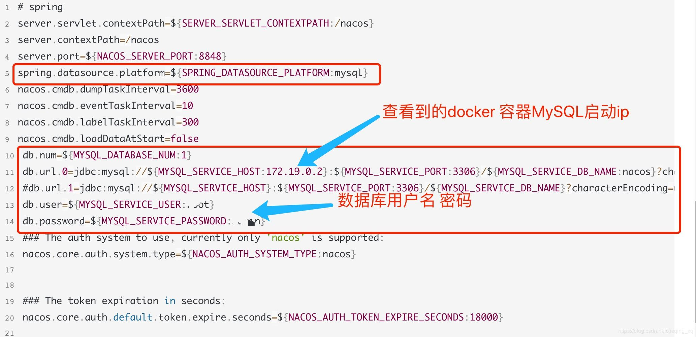

# docker

> 卸载系统之前的docker

```shell
sudo yum remove docker \
                  docker-client \
                  docker-client-latest \
                  docker-common \
                  docker-latest \
                  docker-latest-logrotate \
                  docker-logrotate \
                  docker-engine
                  
                  
sudo yum install -y yum-utils
```

## 配置镜像

```shell
sudo yum-config-manager \
    --add-repo \
    https://download.docker.com/linux/centos/docker-ce.repo
    
sudo yum install docker-ce docker-ce-cli containerd.io

sudo systemctl start docker
```

## 设置开机自启动

```shell
sudo systemctl enable docker
docker -v
sudo docker images
```

## 配置镜像加速

```shell
sudo mkdir -p /etc/docker

sudo tee /etc/docker/daemon.json <<-'EOF'
{
  "registry-mirrors": ["https://y7f7mqtv.mirror.aliyuncs.com"]
}
EOF

sudo systemctl daemon-reload
sudo systemctl restart docker
```

# docker网络

## 创建网络

> docker network create --subnet 192.168.66.0/16  [name]

## 加入网络

> docker network connect --ip 192.168.5.10 [network] [container]

> 同时创建网络

```yaml
services:
  # redis    
  redis:
    image: redis:latest
    container_name: redis
    restart: always
    ports:
      - "6379:6379"
    networks:
      proxy:
        ipv4_address: 172.16.0.9 # 具体ip    
# 网络    
networks:
  proxy:
    ipam:
      config:
        - subnet: 172.16.0.0/24
```

> 加入网络

```yaml
services:
  # redis    
  redis:
    image: redis:latest
    container_name: redis
    restart: always
    ports:
      - "6379:6379"
    networks:
      - persist
networks:
  persist:
    external:
      name: 网络名
```

# mysql

用docker安装上mysql，去docker仓库里搜索mysql

  ```shell
  sudo docker pull mysql:5.7

  # --name指定容器名字 -v目录挂载 -p指定端口映射  -e设置mysql参数 -d后台运行
  sudo docker run -p 3306:3306 --name mysql \
  -v /mydata/mysql/log:/var/log/mysql \
  -v /mydata/mysql/data:/var/lib/mysql \
  -v /mydata/mysql/conf:/etc/mysql \
  -e MYSQL_ROOT_PASSWORD=root \
  -d mysql:5.7
```

```shell
#因为有目录映射，所以我们可以直接在镜像外执行
vi /mydata/mysql/conf/my.conf 

[client]
default-character-set=utf8
[mysql]
default-character-set=utf8
[mysqld]
init_connect='SET collation_connection = utf8_unicode_ci'
init_connect='SET NAMES utf8'
character-set-server=utf8
collation-server=utf8_unicode_ci
skip-character-set-client-handshake
skip-name-resolve

```

docker restart mysql
> docker update mysql--restart=always

# Redis

```shell
# 在虚拟机中
mkdir -p /mydata/redis/conf
touch /mydata/redis/conf/redis.conf

docker pull redis

docker run -p 6379:6379 --name redis \
-v /mydata/redis/data:/data \
-v /mydata/redis/conf/redis.conf:/etc/redis/redis.conf \
-d redis:6.2.5 redis-server /etc/redis/redis.conf

# 直接进去redis客户端。
docker exec -it redis redis-cli
```

```shell
vim /mydata/redis/conf/redis.conf
# 插入下面内容
appendonly yes
#保存
```

docker restart redis
> docker update redis --restart=always

# nginx

```shell
docker pull nginx:1.10
# 随便启动一个nginx实例，只是为了复制出配置，放到docker里作为镜像的统一配置
docker run -p 80:80 --name nginx -d nginx:1.10

cd /mydata/nginx
docker container cp nginx:/etc/nginx .
# 然后在外部 /mydata/nginx/nginx 有了一堆文件
mv /mydata/nginx/nginx /mydata/nginx/conf
# 停掉nginx
docker stop nginx
docker rm nginx

# 创建新的nginx
docker run -p 80:80 --name nginx \
-v /mydata/nginx/html:/usr/share/nginx/html \
-v /mydata/nginx/logs:/var/log/nginx \
-v /mydata/nginx/conf:/etc/nginx \
-d nginx:1.10

# 注意一下这个路径映射到了/usr/share/nginx/html，我们在nginx配置文件中是写/usr/share/nginx/html，不是写/mydata/nginx/html

docker update nginx --restart=always
```

# elasticsearch

```shell
docker pull elasticsearch:7.6.2
docker pull kibana:7.6.2
#版本要统一
```

> 配置

```shell
# 将docker里的目录挂载到linux的/mydata目录中
# 修改/mydata就可以改掉docker里的
mkdir -p /mydata/elasticsearch/config
mkdir -p /mydata/elasticsearch/data

# es可以被远程任何机器访问
echo "http.host: 0.0.0.0" >/mydata/elasticsearch/config/elasticsearch.yml

# 递归更改权限，es需要访问
chmod -R 777 /mydata/elasticsearch/
```

> 启动Elastic search

```shell
# 9200是用户交互端口 9300是集群心跳端口
# -e指定是单阶段运行
# -e指定占用的内存大小，生产时可以设置32G
docker run --name elasticsearch -p 9200:9200 -p 9300:9300 \
-e  "discovery.type=single-node" \
-e ES_JAVA_OPTS="-Xms64m -Xmx512m" \
-v /mydata/elasticsearch/config/elasticsearch.yml:/usr/share/elasticsearch/config/elasticsearch.yml \
-v /mydata/elasticsearch/data:/usr/share/elasticsearch/data \
-v  /mydata/elasticsearch/plugins:/usr/share/elasticsearch/plugins \
-d elasticsearch:7.6.2


# 设置开机启动elasticsearch
docker update elasticsearch --restart=always
```

> 启动kibana

```shell
# kibana指定了了ES交互端口9200  # 5600位kibana主页端口
docker run --name kibana -e ELASTICSEARCH_HOSTS=http://192.168.56.10:9200 -p 5601:5601 -d kibana:7.6.2


# 设置开机启动kibana
docker update kibana  --restart=always
```

http://xxx.xxx.xx.xx:9200

http://xxx.xxx.xx.xx:5601/app/kibana

# RabbitMQ

```shell

docker run -d --name rabbitmq \
-p 5671:5671 -p 5672:5672 -p 4369:4369 \
-p 25672:25672 -p 15671:15671 -p 15672:15672\
rabbitmq:management

```

> 4369, 25672 (Erlang发现&集群端口)
> 5672, 5671 (AMQP端口)
> 15672 (web管理后台端口)
> 61613, 61614 (STOMP协议端口)
> 1883, 8883 (MQTT协议端口)

# nacos

```shell
docker pull nacos/nacos-server:1.4.2
docker run -d -p 8848:8848 --env MODE=standalone  --name nacos nacos/nacos-server

#进入容器 
docker exec -it nacos bash
#修改容器配置
cd conf
vi application.properties
```

> spring.datasource.platform=mysql 必须配置mysql




> docker update nacos --restart=always

# elk

> 需要提前把文件下载

```shell
 docker run -d -p 5044:5044 --name logstash \
  -v /mydata/log/logstash/config/:/usr/share/logstash/config/ \
  -v /mydata/log/logstash/pipeline/:/usr/share/logstash/pipeline/ \
  -p 5044:5044  \
  -p 9600:9600 \
  docker.elastic.co/logstash/logstash:7.6.2 
```

```config
#aracter at the beginning of a line indicates a comment. Use
# comments to describe your configuration.
input {
 beats {
        port => "5044"
    }
}
# The filter part of this file is commented out to indicate that it is
# optional.
 # filter {
 #    dissect  {
#        mapping => { "message" => "%{date} %{thread} %{5level} [%{logger} %{file}:%{line}]- %{msg}" }
#     }
# }
output {
     stdout { codec => rubydebug }
     elasticsearch {
        hosts => [ "192.168.56.10:9200" ]
        index => "%{[host][name]}-%{+YYYY.MM.dd}"
     }
}
```

```yaml
# This file is where you define your pipelines. You can define multiple.
# For more information on multiple pipelines, see the documentation:
#   https://www.elastic.co/guide/en/logstash/current/multiple-pipelines.html

- pipeline.id: main
  path.config: "/usr/share/logstash/pipeline"

#- pipeline.id: inputlog
#  config.string: |
#    input { beats { port => 5044 } }
#    output {
#        if [name] == wms-oms-web {
#          pipeline { send_to => syslog }
#        } else if [name] == system {
#          pipeline { send_to => syslog }
#        }
#    }
#- pipeline.id: outputlog
#  config.string: input { pipeline { address => syslog } }
#  path.config: "/usr/share/logstash/pipeline"
```

