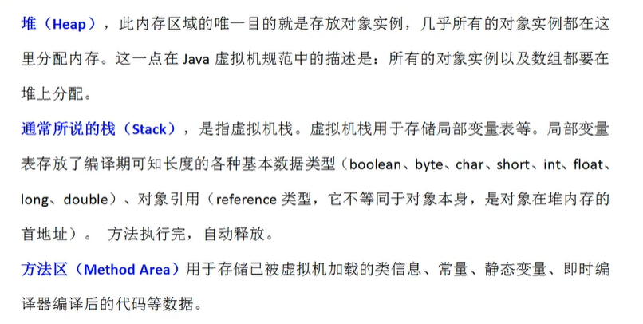

# maven配置

## Maven静态资源导出问题

```xml
<build>
    <resources>
        <resource>
            <directory>src/main/java</directory>
            <includes>
                <include>**/*.properties</include>
                <include>**/*.xml</include>
                <include>**/*.yml</include>
            </includes>
            <filtering>false</filtering>
        </resource>
        <resource>
            <directory>src/main/resources</directory>
            <includes>
                <include>**/*.properties</include>
                <include>**/*.xml</include>
                <include>**/*.yml</include>
                 <include>**/*.html</include>
            </includes>
            <filtering>false</filtering>
        </resource>
    </resources>
</build>
```

打包成war包

```xml
  <build>
        <plugins>
            <plugin>
                <groupId>org.apache.maven.plugins</groupId>
                <artifactId>maven-war-plugin</artifactId>
                <configuration>
  <!-- 对丢失web.xml检测机制进行忽略， Dynamic Web Module 3.0 工程时代不需要web.xml文件注册相关内容的，所以工程默认不生成web.xml。-->
                    <failOnMissingWebXml>false</failOnMissingWebXml>
                </configuration>
            </plugin>
 
            <plugin>
                <groupId>org.apache.maven.plugins</groupId>
                <artifactId>maven-compiler-plugin</artifactId>
                <version>3.2</version>
                <executions>
                    <execution>
                        <id>default-compile</id>
                        <phase>compile</phase>
                        <goals>
                            <goal>compile</goal>
                        </goals>
                    </execution>
                </executions>
                <configuration>
    <!-- 使用jdk1版本时使用该配置，如果要使用jdk1.8，则下面2行要修改为1.8 -->
                    <source>1.8</source>
                    <target>1.8</target>
                    <encoding>UTF-8</encoding>
                </configuration>
            </plugin>
        </plugins>
    </build>
```

## JSTL依赖

```xml
<!-- https://mvnrepository.com/artifact/javax.servlet/jstl -->
<dependency>
    <groupId>javax.servlet</groupId>
    <artifactId>jstl</artifactId>
    <version>1.2</version>
</dependency>

<!-- https://mvnrepository.com/artifact/taglibs/standard -->
<dependency>
    <groupId>taglibs</groupId>
    <artifactId>standard</artifactId>
    <version>1.1.2</version>
</dependency>
```

# Servlet配置

```xml
<Host appBase="webapps" autoDeploy="true" name="localhost" unpackWARs="true">
		<Context docBase="项目名或war包" path="/" reloadable="ture">

     <Resource author="Container" driverClassName="com.mysql.jdbc.Driver" maxActive="10" maxIdle="1" maxWait="10" name="jdbc/tr01601" password="123456" type="javax.sql.DataSource" url="jdbc:mysql://localhost:3306/jspproject?characterEncoding=utf-8" username="root" /> 
		</Context>
    
</Host>
```

# Mybatis配置文件

## pagehelper分页

```xml
<plugins>
    <!-- com.github.pagehelper为PageHelper类所在包名 -->
    <plugin interceptor="com.github.pagehelper.PageInterceptor">
        <!-- 4.0.0以后版本可以不设置该参数 -->
        <!-- 该参数默认为false -->
        <!-- 设置为true时，会将RowBounds第一个参数offset当成pageNum页码使用 -->
        <!-- 和startPage中的pageNum效果一样 -->
        <property name="offsetAsPageNum" value="false"/>
        <!-- 该参数默认为false -->
        <!-- 设置为true时，使用RowBounds分页会进行count查询 -->
        <property name="rowBoundsWithCount" value="false"/>
        <!-- 设置为true时，如果pageSize=0或者RowBounds.limit = 0就会查询出全部的结果 -->
        <!-- （相当于没有执行分页查询，但是返回结果仍然是Page类型） -->
        <property name="pageSizeZero" value="true"/>
        <!-- 3.3.0版本可用 - 分页参数合理化，默认false禁用 -->
        <!-- 启用合理化时，如果pageNum<1会查询第一页，如果pageNum>pages会查询最后一页 -->
        <!-- 禁用合理化时，如果pageNum<1或pageNum>pages会返回空数据 -->
        <property name="reasonable" value="false"/>
        <!-- 支持通过Mapper接口参数来传递分页参数 -->
        <property name="supportMethodsArguments" value="false"/>
        <!-- always总是返回PageInfo类型,check检查返回类型是否为PageInfo,none返回Page -->
        <property name="returnPageInfo" value="none"/>
    </plugin>
</plugins>
```

### 配置1

```properties
#将等级为DEBUG的日志信息输出到console和file这两个目的地，console和file的定义在下面的代码
log4j.rootLogger=DEBUG,console,file

#控制台输出的相关设置
log4j.appender.console = org.apache.log4j.ConsoleAppender
log4j.appender.console.Target = System.out
log4j.appender.console.Threshold=DEBUG
log4j.appender.console.layout = org.apache.log4j.PatternLayout
log4j.appender.console.layout.ConversionPattern=[%c]-%m%n

#文件输出的相关设置
log4j.appender.file = org.apache.log4j.RollingFileAppender
log4j.appender.file.File=./log/test.log
log4j.appender.file.MaxFileSize=10mb
log4j.appender.file.Threshold=DEBUG
log4j.appender.file.layout=org.apache.log4j.PatternLayout
log4j.appender.file.layout.ConversionPattern=[%p][%d{yy-MM-dd HH:mm:ss:SSS}][%c]%m%n

#日志输出级别
log4j.logger.org.mybatis=DEBUG
log4j.logger.java.sql=DEBUG
log4j.logger.java.sql.Statement=DEBUG
log4j.logger.java.sql.ResultSet=DEBUG
log4j.logger.java.sql.PreparedStatement=DEBUG
```

### 配置2

```properties
# -----------------日志配置文件
# rootLogger配置日志根Logger 格式：[日志级别①],输出目的地1,输出目的地2,输出目的地3......
log4j.rootLogger=warn,zktr,hyt,forDate,mysql
# -----------------配置日志输出目的地（log4j.appender.目的地的名字）
# 目的地zktr日志会输出System.out目标的信息，格式是（日志时间%d,日志内容%m,日志换行%n）
log4j.appender.zktr=org.apache.log4j.ConsoleAppender
log4j.appender.zktr.Target=System.out
log4j.appender.zktr.layout=org.apache.log4j.PatternLayout
log4j.appender.zktr.layout.ConversionPattern=%l %d{yyyy-MM-dd HH:mm:ss}  %m%n

# 目的地hyt会在文件(默认在tomcat的bin目录下)中输出日志，格式是（日志时间%d,日志位置%l,日志内容%m,日志换行%n）
log4j.appender.hyt=org.apache.log4j.FileAppender
log4j.appender.hyt.File=logs/2000-1-1.log
log4j.appender.hyt.layout=org.apache.log4j.PatternLayout
log4j.appender.hyt.layout.ConversionPattern=%d{yyyy-MM-dd HH:mm:ss} %l %m%n

### 指定固定的路径，以日期为文件名每天一个（当天默认是log.log,修改当天日期可看到会把之前的文件名进行修改logxxxx.log） ###
log4j.appender.forDate = org.apache.log4j.DailyRollingFileAppender
log4j.appender.forDate.File = d:/log4j/log.log
log4j.appender.forDate.DatePattern=yyyy-MM-dd'.log'
log4j.appender.forDate.Append = true
## 只输出DEBUG级别以上的日志!!
log4j.appender.forDate.Threshold = DEBUG
log4j.appender.forDate.layout = org.apache.log4j.PatternLayout
log4j.appender.forDate.layout.ConversionPattern = %-d{yyyy-MM-dd HH:mm:ss} [ %t:%r ] - [ %p ] %m%n

#目的地mysql会把日志输出到数据库表mylog中。(类的全称%c,日志级别%p,日志内容%m,日志换行%n)
log4j.appender.mysql=org.apache.log4j.jdbc.JDBCAppender
log4j.appender.mysql.driver=com.mysql.jdbc.Driver
log4j.appender.mysql.URL=jdbc:mysql://localhost:3306/test?useUnicode=true&characterEncoding=UTF-8
log4j.appender.mysql.user=root
log4j.appender.mysql.password=123456
log4j.appender.mysql.sql=insert into mylog (create_time,info) VALUES ('%d{yyyy-MM-dd hh:mm:ss}', '%c %p %m %n')
log4j.appender.mysql.layout=org.apache.log4j.PatternLayout
```

### log4j级别

```java
logger.debug("我是调试信息");
logger.info("基本信息");
logger.warn("警告");
logger.error("错误");
logger.fatal("致命错误");
```

### 格式

```properties
%c        logger名字空间
%c{2}    如果加上{<层数>}表示列出从最内层算起的指定层数的名字空间
%C        列出调用logger的类的全名（包含包路径）

%d    显示日志记录时间
%d{yyyy/MM/dd HH:mm:ss,SSS}
%d{yyy MMM dd HH:mm:ss,SSS}，输出类似：2002年10月18日 22：10：28，921
%d{ISO8601}    2005-10-12 22:23:30,117

%F    显示调用logger的源文件名
%l     输出日志事件的发生位置，包括类目名、发生的线程，以及在代码中的行数
%L    显示调用logger的代码行
%m   显示输出消息
%M   显示调用logger的方法名

%n    当前平台下的换行符
%p    显示该条日志的优先级
%r     显示从程序启动时到记录该条日志时已经经过的毫秒数
```

### 完整版

```properties
# -----------------日志配置文件
# rootLogger配置日志根Logger 格式：[日志级别①],输出目的地1,输出目的地2,输出目的地3......
log4j.rootLogger=debug,zktr,hyt,forDate

# -----------------配置日志输出目的地（log4j.appender.目的地的名字）
# 目的地zktr日志会输出System.out目标的信息，格式是（日志时间%d,日志内容%m,日志换行%n）
log4j.appender.zktr=org.apache.log4j.ConsoleAppender
log4j.appender.zktr.Target=System.out
log4j.appender.zktr.layout=org.apache.log4j.PatternLayout
log4j.appender.zktr.layout.ConversionPattern=%d{yyyy-MM-dd HH:mm:ss} %m%n

# 目的地hyt会在文件(默认在tomcat的bin目录下)中输出日志，格式是（日志时间%d,日志位置%l,日志内容%m,日志换行%n）
log4j.appender.hyt=org.apache.log4j.FileAppender
log4j.appender.hyt.File=logs/2000-1-1.log
log4j.appender.hyt.layout=org.apache.log4j.PatternLayout
log4j.appender.hyt.layout.ConversionPattern=%d{yyyy-MM-dd HH:mm:ss} %l %m%n

### 指定固定的路径，以日期为文件名每天一个（当天默认是log.log,修改当天日期可看到会把之前的文件名进行修改logxxxx.log） ###
log4j.appender.forDate = org.apache.log4j.DailyRollingFileAppender
log4j.appender.forDate.File = d:/log4j/log.log
log4j.appender.forDate.DatePattern=yyyy-MM-dd'.log'
log4j.appender.forDate.Append = true
## 只输出DEBUG级别以上的日志!!
log4j.appender.forDate.Threshold = DEBUG
log4j.appender.forDate.layout = org.apache.log4j.PatternLayout
log4j.appender.forDate.layout.ConversionPattern = %-d{yyyy-MM-dd HH:mm:ss} [ %t:%r ] - [ %p ] %m%n

#目的地mysql会把日志输出到数据库表mylog中。(类的全称%c,日志级别%p,日志内容%m,日志换行%n)
#log4j.appender.mysql=org.apache.log4j.jdbc.JDBCAppender
#log4j.appender.mysql.driver=com.mysql.jdbc.Driver
#log4j.appender.mysql.URL=jdbc:mysql://localhost:3306/test?useUnicode=true&characterEncoding=UTF-8
#log4j.appender.mysql.user=root
#log4j.appender.mysql.password=123456
#log4j.appender.mysql.sql=insert into mylog (create_time,info) VALUES ('%d{yyyy-MM-dd hh:mm:ss}', '%c %p %m %n')
#log4j.appender.mysql.layout=org.apache.log4j.PatternLayout


# 需要加载驱动和建表
#CREATE TABLE mylog(
#logid BIGINT PRIMARY KEY AUTO_INCREMENT,
#create_time TIMESTAMP,
#info VARCHAR(200)
#);

#输出到oracle数据库
#log4j.appender.oracle=org.apache.log4j.jdbc.JDBCAppender
#log4j.appender.oracle.driver=oracle.jdbc.driver.OracleDriver
#xe是oracle的实例名，一般是orcl
#log4j.appender.oracle.URL=jdbc:oracle:thin:@127.0.0.1:1521:xe
#log4j.appender.oracle.user=scott
#log4j.appender.oracle.password=123456
#log4j.appender.oracle.sql=insert into class_log (create_time,log) VALUES ('%d{yyyy-MM-dd hh:mm:ss}', '%c %p %m %n')
#log4j.appender.oracle.layout=org.apache.log4j.PatternLayout


# ① 日志级别，Log4j常用四个级别，优先级从高到低分别是ERROR、WARN、INFO、DEBUG
# 通过定义的级别，可以控制到应用程序中相应级别的日志信息的开关。比如WARN级别，则低于WARN级别（INFO/DEBUG）的日志信息将不被打印出来
```

## Mybatis-config配置文件

```xml
<?xml version="1.0" encoding="UTF-8" ?>
<!DOCTYPE configuration
        PUBLIC "-//mybatis.org//DTD Config 3.0//EN"
        "http://mybatis.org/dtd/mybatis-3-config.dtd">
<configuration>
    <environments default="development">
        <environment id="development">
            <transactionManager type="JDBC"/>
            <dataSource type="POOLED">
                <property name="driver" value="com.mysql.cj.jdbc.Driver"/>
                <property name="url"
                          value="jdbc:mysql://localhost:3306/mybatis?useUnicode=true&amp;characterEncoding=UTF8&amp;serverTimezone=Asia/Shanghai"/>
                <property name="username" value="root"/>
                <property name="password" value="123456"/>
            </dataSource>
        </environment>
    </environments>

    <mappers>
        <package name="com.test.mapper"/>
    </mappers>
</configuration>
```

## mapper配置文件

```xml
<?xml version="1.0" encoding="UTF-8" ?>
<!DOCTYPE mapper
  PUBLIC "-//mybatis.org//DTD Mapper 3.0//EN"
  "http://mybatis.org/dtd/mybatis-3-mapper.dtd">
<mapper namespace="org.mybatis.example.BlogMapper">
  <select id="selectBlog" resultType="Blog">
    select * from Blog where id = #{id}
  </select>
</mapper>
```

## Mybatis缓存配置

* 所有的数据都会先放入一级缓存中,只有提交或关闭时.才会放入二级缓存

```xml
 <!--在当前Mapper.xml中开启二级缓存-->
<!--flushInterval（刷新间隔）属性可以被设置为任意的正整数，设置的值应该是一个以毫秒为单位的合理时间量。 默认情况是不设置，也就是没有刷新间隔，缓存仅仅会在调用语句时刷新。
size（引用数目）属性可以被设置为任意正整数，要注意欲缓存对象的大小和运行环境中可用的内存资源。默认值是 1024。
readOnly（只读）属性可以被设置为 true 或 false。只读的缓存会给所有调用者返回缓存对象的相同实例。 因此这些对象不能被修改。这就提供了可观的性能提升。而可读写的缓存会（通过序列化）返回缓存对象的拷贝。 速度上会慢一些，但是更安全，因此默认值是 false。-->
    <cache
            eviction="FIFO"
            flushInterval="60000"
            size="512"
            readOnly="true"/>
```

## 自定义缓存-encache

```xml
EhCache 是一个纯Java的进程内缓存框架，具有快速、精干等特点，是Hibernate中默认的CacheProvider。
```

### 要在程序中使用ehcache，先要导包！

```xml
<!-- https://mvnrepository.com/artifact/org.mybatis.caches/mybatis-ehcache -->
<dependency>
    <groupId>org.mybatis.caches</groupId>
    <artifactId>mybatis-ehcache</artifactId>
    <version>1.1.0</version>
</dependency>

```

### 然后在mapper中指定使用ehcache缓存实现

```xml
<!--在当前Mapper.xml中使用二级缓存-->
<cache type="org.mybatis.caches.ehcache.EhcacheCache"/>
```

### 导入配置文件 ehcache.xml

```xml
<?xml version="1.0" encoding="UTF-8"?>
<ehcache xmlns:xsi="http://www.w3.org/2001/XMLSchema-instance"
         xsi:noNamespaceSchemaLocation="http://ehcache.org/ehcache.xsd"
         updateCheck="false">
    <!--
       diskStore：为缓存路径，ehcache分为内存和磁盘两级，此属性定义磁盘的缓存位置。参数解释如下：
       user.home – 用户主目录
       user.dir  – 用户当前工作目录
       java.io.tmpdir – 默认临时文件路径
     -->
    <diskStore path="java.io.tmpdir/Tmp_EhCache"/>
    <!--
       defaultCache：默认缓存策略，当ehcache找不到定义的缓存时，则使用这个缓存策略。只能定义一个。
     -->
    <!--
      name:缓存名称。
      maxElementsInMemory:缓存最大数目
      maxElementsOnDisk：硬盘最大缓存个数。
      eternal:对象是否永久有效，一但设置了，timeout将不起作用。
      overflowToDisk:是否保存到磁盘，当系统当机时
      timeToIdleSeconds:设置对象在失效前的允许闲置时间（单位：秒）。仅当eternal=false对象不是永久有效时使用，可选属性，默认值是0，也就是可闲置时间无穷大。
      timeToLiveSeconds:设置对象在失效前允许存活时间（单位：秒）。最大时间介于创建时间和失效时间之间。仅当eternal=false对象不是永久有效时使用，默认是0.，也就是对象存活时间无穷大。
      diskPersistent：是否缓存虚拟机重启期数据 Whether the disk store persists between restarts of the Virtual Machine. The default value is false.
      diskSpoolBufferSizeMB：这个参数设置DiskStore（磁盘缓存）的缓存区大小。默认是30MB。每个Cache都应该有自己的一个缓冲区。
      diskExpiryThreadIntervalSeconds：磁盘失效线程运行时间间隔，默认是120秒。
      memoryStoreEvictionPolicy：当达到maxElementsInMemory限制时，Ehcache将会根据指定的策略去清理内存。默认策略是LRU（最近最少使用）。你可以设置为FIFO（先进先出）或是LFU（较少使用）。
      clearOnFlush：内存数量最大时是否清除。
      memoryStoreEvictionPolicy:可选策略有：LRU（最近最少使用，默认策略）、FIFO（先进先出）、LFU（最少访问次数）。
      FIFO，first in first out，这个是大家最熟的，先进先出。
      LFU， Less Frequently Used，就是上面例子中使用的策略，直白一点就是讲一直以来最少被使用的。如上面所讲，缓存的元素有一个hit属性，hit值最小的将会被清出缓存。
      LRU，Least Recently Used，最近最少使用的，缓存的元素有一个时间戳，当缓存容量满了，而又需要腾出地方来缓存新的元素的时候，那么现有缓存元素中时间戳离当前时间最远的元素将被清出缓存。
   -->
    <defaultCache
            eternal="false"
            maxElementsInMemory="10000"
            overflowToDisk="false"
            diskPersistent="false"
            timeToIdleSeconds="1800"
            timeToLiveSeconds="259200"
            memoryStoreEvictionPolicy="LRU"/>
 
    <cache
            name="cloud_user"
            eternal="false"
            maxElementsInMemory="5000"
            overflowToDisk="false"
            diskPersistent="false"
            timeToIdleSeconds="1800"
            timeToLiveSeconds="1800"
            memoryStoreEvictionPolicy="LRU"/>
 
</ehcache>
```

# Spring配置文件

## Beans.xml配置

```xml
<?xml version="1.0" encoding="UTF-8"?>
<beans xmlns="http://www.springframework.org/schema/beans"
       xmlns:xsi="http://www.w3.org/2001/XMLSchema-instance"
       xsi:schemaLocation="http://www.springframework.org/schema/beans
        https://www.springframework.org/schema/beans/spring-beans.xsd">

</beans>
```

## 使用c和p命令空间进行注入：

* p命名空间可以理解properties注入
* c命名空间用构造函数注入

```xml
 xmlns:p="http://www.springframework.org/schema/p"
xmlns:c="http://www.springframework.org/schema/c"

<?xml version="1.0" encoding="UTF-8"?>
<beans xmlns="http://www.springframework.org/schema/beans"
       xmlns:xsi="http://www.w3.org/2001/XMLSchema-instance"
       xsi:schemaLocation="http://www.springframework.org/schema/beans
        https://www.springframework.org/schema/beans/spring-beans.xsd">
</beans>
```

## 使用注解

```xml
xmlns:context="http://www.springframework.org/schema/context"
http://www.springframework.org/schema/context
https://www.springframework.org/schema/context/spring-context.xsd
<?xml version="1.0" encoding="UTF-8"?>
<beans xmlns="http://www.springframework.org/schema/beans"
    xmlns:xsi="http://www.w3.org/2001/XMLSchema-instance"
    xmlns:context="http://www.springframework.org/schema/context"
    xsi:schemaLocation="http://www.springframework.org/schema/beans
        https://www.springframework.org/schema/beans/spring-beans.xsd
        http://www.springframework.org/schema/context
        https://www.springframework.org/schema/context/spring-context.xsd">

    <context:annotation-config/>

</beans>
```

> ​ @Qualifier

## spring aop

* 要使用spring aop 需要导入aop织入[aspectjweaver]依赖

## Spring整合mybatis

```xml
<?xml version="1.0" encoding="UTF-8"?>
<beans xmlns="http://www.springframework.org/schema/beans"
       xmlns:xsi="http://www.w3.org/2001/XMLSchema-instance"
       xmlns:aop="http://www.springframework.org/schema/aop"
       xmlns:tx="http://www.springframework.org/schema/tx"
       xsi:schemaLocation="http://www.springframework.org/schema/beans
        https://www.springframework.org/schema/beans/spring-beans.xsd
        http://www.springframework.org/schema/aop
        https://www.springframework.org/schema/aop/spring-aop.xsd
        http://www.springframework.org/schema/tx
        https://www.springframework.org/schema/tx/spring-tx.xsd">


    <bean id="dataSource" class="org.springframework.jdbc.datasource.DriverManagerDataSource">
        <property name="url"
                  value="jdbc:mysql://localhost:3306/mybatis?useUnicode=true&amp;characterEncoding=UTF8&amp;serverTimezone=Asia/Shanghai"/>
        <property name="driverClassName" value="com.mysql.cj.jdbc.Driver"/>
        <property name="username" value="root"/>
        <property name="password" value="123456"/>
    </bean>

    <bean id="sqlSessionFactory" class="org.mybatis.spring.SqlSessionFactoryBean">
        <property name="configLocation" value="classpath:mybatis-config.xml"/>
        <property name="mapperLocations" value="classpath:com/test/mapper/*.xml"/>
        <property name="dataSource" ref="dataSource"/>
    </bean>

    <bean id="dataSourceTransactionManager" class="org.springframework.jdbc.datasource.DataSourceTransactionManager">
        <constructor-arg ref="dataSource"/>
    </bean>

    <tx:advice transaction-manager="dataSourceTransactionManager" id="transactionInterceptor">
        <tx:attributes>
            <tx:method name="*"/>
        </tx:attributes>
    </tx:advice>

    <aop:config>
        <aop:pointcut id="pointCut" expression="execution(* com.test.mapper.*.*(..))"/>
        <aop:advisor advice-ref="transactionInterceptor" pointcut-ref="pointCut"/>
    </aop:config>

</beans>
```

# spring-mybatis

## spring配置文件

```xml
<bean id="dataSource" class="org.springframework.jdbc.datasource.DriverManagerDataSource">
        <property name="url"
                  value="jdbc:mysql://localhost:3306/mybatis?useUnicode=true&amp;characterEncoding=UTF8&amp;serverTimezone=Asia/Shanghai"/>
        <property name="driverClassName" value="com.mysql.cj.jdbc.Driver"/>
        <property name="username" value="root"/>
        <property name="password" value="123456"/>
    </bean>

    <bean id="sqlSessionFactory" class="org.mybatis.spring.SqlSessionFactoryBean">
        <property name="configLocation" value="classpath:mybatis-config.xml"/>
        <property name="mapperLocations" value="classpath:com/test/mapper/*.xml"/>
        <property name="dataSource" ref="dataSource"/>
    </bean>

    <bean id="dataSourceTransactionManager" class="org.springframework.jdbc.datasource.DataSourceTransactionManager">
        <constructor-arg ref="dataSource"/>
    </bean>

    <tx:advice transaction-manager="dataSourceTransactionManager" id="transactionInterceptor">
        <tx:attributes>
            <tx:method name="*"/>
        </tx:attributes>
    </tx:advice>

   <aop:config>
    <aop:pointcut id="pointCut" expression="execution(* com.test.mapper.*.*(..))"/>
        <aop:advisor advice-ref="transactionInterceptor" pointcut-ref="pointCut"/>
    </aop:config>

```

# SpringMVC

## 使用注解

```java
public class MyWebApplicationInitializer implements WebApplicationInitializer {
    @Override
    public void onStartup(ServletContext servletContext) throws ServletException {
        AnnotationConfigWebApplicationContext ac =
            new AnnotationConfigWebApplicationContext();
        ac.register(AppConfig.class);
        ac.setServletContext(servletContext);
        ac.refresh();

        DispatcherServlet servlet = new DispatcherServlet(ac);
        ServletRegistration.Dynamic dynamic =
            servletContext.addServlet("app", servlet);
        dynamic.setLoadOnStartup(1);
        dynamic.addMapping("/");

    }

```

## 开启annotion

```xml
<context:component-scan base-package="com.test"/>
<!--过滤静态资源-->
<mvc:default-servlet-handler/>
<!--开启自动处理器映射器和处理器适配器-->
<mvc:annotation-driven/>
```

## JSON解析方法

```xml
jackson
fastjson   <!--阿里巴巴的解析工具-->
```

## 返回数据前台

```java
@Controller
//@RestController //把这个类里面所有的方法都不走视图解析器,直接返回数据给前台body
public class Api {
    @RequestMapping("/t")
    @ResponseBody //一般配合Controller使用,不走视图解析器.直接返回数据给前台body
    public String test() 
```

## json乱码问题

```xml
<mvc:annotation-driven>
        <mvc:message-converters register-defaults="true">
            <bean class="org.springframework.http.converter.StringHttpMessageConverter">
                <constructor-arg value="UTF-8"/>
            </bean>
            <bean class="org.springframework.http.converter.json.MappingJackson2HttpMessageConverter">
                <property name="objectMapper">
                    <bean class="org.springframework.http.converter.json.Jackson2ObjectMapperFactoryBean">
                        <property name="failOnEmptyBeans" value="false"/>
                    </bean>
                </property>
            </bean>
        </mvc:message-converters>
</mvc:annotation-driven>
```

## Json时间格式

```java
//1.如何让他不返回时间戳！所以我们要关闭它的时间戳功能
mapper.configure(SerializationFeature.WRITE_DATES_AS_TIMESTAMPS,false);
//2.时间格式化问题！自定日期格式对象；
SimpleDateFormat sdf = new SimpleDateFormat("yyyy-MM-dd HH:mm:ss");
//3.让mapper指定时间日期格式为simpleDateFormat；
mapper.setDateFormat(sdf);
```

# 数据源

* c3p0:半自动化操作,不自动连接
* dbcp:全自动操作
* druid:可以很好的监控DB池和sql执行情况,用来针对监控而生的DB连接池
* hikari :快

# Spring-Boot

## 配置文件存放位置

> ​ 详情参考源码

* file:/config/
* file:./
* classpath:/config/
* classpath:/

## 静态资源存放位置

> ​ 详情参考源码

* classpath:/META-INF/resources/webjes/
* classpath:/META-INF/resources/
* classpath:/resources/
* classpath:/static/
* classpath:/public/

# Thymeleaf

```html
 <html xmlns:th="http://www.thymeleaf.org">
```

### 简单表达式

- 变量表达式： `${...}`
- 选择变量表达式： `*{...}`
- 消息表达： `#{...}`
- 链接URL表达式： `@{...}`
- 片段表达式： `~{...}`

# jsp

## jsp返回上一页

```jsp
 <a href="javascript:history.back(-1)">返回上一页</a>
```

## servlet接收 处理 响应

```java
protected void doGet（.........）{
  String js = request.getParameter("js");//接收jsp传过来的数据
  JSONArray json = JSONArray.fromObject(js);//对数据进行数组转化
  JSONObject jsonOne = json.getJSONObject(0);//获取确定的json对象
  boolean flag = true;
  PrintWriter out = response.getWriter();
  out.print(flag);//将flag传给jsp
  out.close();
}
```

# css

```css
!important;    设置优先级
```

# Jquery

```javascript
$("p").slideDown(); 以滑动方式显示隐藏的 <p> 元素：
$("p").slideUp();  以滑动方式隐藏 <p> 元素：
```

# Oracle

## oracle数据库解释

* oracle数据库

    * 物理文件的集合
        * 数据文件
        * 控制文件
        * 参数文件

* 数据库的==实例==.现在使用的是xe,默认是orcl

    * 一组oracle后台进程/线程,服务器分配的共享内存区

      工具原理

      > 在启动oracle数据库的服务时.实际上在服务器的内存中创建一个实例,**(
      在服务器内存中分配共享内存并创建相关的后台程序)**然后由这个oracle数据库的实例来访问和控制磁盘中的数据文件

表空间:

* oracle数据库看做房间
* 表空间就是房间的空间,可以自由分配
* 在这个空间里面可以堆放很多箱子
* 箱子的内容就会数据库表
* 用户指定表空间就是希望把用户所属的表存放咱对应的空间中

## 数据类型

* 字符类型
    * ==char== 固定长度
    * ==varchar2== 不固定长度     (最大长度4000)
* 数值类型
    * ==number==  (5,2)       总共5位,小数点后保留2位
* 日期类型
    * ==data== 年月日时分秒
    * ==timestamp== 年月日时分秒毫秒 ,保留小数点后6位

## 创建一个新的用户

### 用system创建一个scort

```sql
create user scott identified by 123456;
```

### 给新用户授权

```sql
#connect   连接全选(临时用户)
#resource  操作权限(资源权限)
#dba   数据管理权限(新增用户,权限等)

grant connect to scott
```

## 创建student表:

* 编号,名字,手机,性别,出生日期,存款

```sql
create table student(			
	s_id number(10) not null primary key,  --id
    sname varchar2(20) not null,		--名字
    tel char(11),						--手机号码
    sex char(2),                  --长度1
    birth date,
    money number(10)
)
```

### 插入数据

```sql
--日期函数to_date('2000-01-01','yyyy-mm-dd')
insert into student values(1,'张智','12345678912','1',to_date('2000-01-01','yyyy-mm-dd'),200.22);
```

### 查看数据

```sql
 select * from student;
```

### 给表字段添加注释

```sql
comment on column student.s_id is '学号';
```

### 倒叙查询

```sql
select rowid,student.* from student order by s_id desc;
```

### 伪劣查询(由18个字符组成)

```sql
 select rowid from student;     --固定
 select rownum from student;	--用于分页
```

## 表空间操作

```sql
/*
create tablespace 
datafile 
size	--初始大小
autoextend  ----自动扩展
next	--增长量
maxsize --最大容量
*/
create tablespace scott_tablespace
datafile 	'scott_tablespace.dbf'
size	2m	
autoextend on
next	1m 		
maxsize 10m;	
```

### 查看表空间

```sql
select file_name,tablespace_name from dba_data_files
```

### 新建一个用户,并分配表空间

```sql
--新建一个用户,并分配给用户一个默认的表空间
create user haha identified by 123456
default tanlespace SCOTT_TABLESPACE
```

### 删除用户的表空间

```sql
--删除表空间,建议把数据文件删除
drop tablespace SCOTT_TABLESPACE 
inocluding contents and datafiles;
```

## ==序列sequence==

### 语法

```sql
create sequence 序列名
[increment by n] --步长,默认1,每次递增的量
[start with x] --序列的初始值,默认1
[maxvalue m] --序列的最大值,不知道则表示该数据类型的最大值
[cycle|nocycle] --打到上限是否重新来过
[cache c] --缓存的数量

/*
序列和表没有关系,但是一个序列尽量值作用一个表
*/
```

### 创建

```;
create sequence sq_student
increment by 1
start with 6;
```

### 使用

```sql
--首次使用必须调用nextval
select sq_student.nextval from dual;

insert into student values(sq_student.nextval,....)
```

## ==存储过程==

procedure可以用编程的方式来操作sql的代码集合

优点

* 预编译,执行效率高,在创建时就编译好了
* 通过控制语句可以一次性执行多条sql语句,完成一个完整的功能或者业务需求
* 复用性高

缺点

* 移植性差
* 可读性差
* 以维护性差

### 语法结构

```sql
create [or replace] procedure  #名字(参数)
is
	--变量声明区
begin 
 --逻辑处理区域
end;
```

## 函数

> ​ 特点:和存储过程类似,但可以有返回值

区别 存储过程 函数

关键字 procedure function

返回值 必须有形参out 可以用函数名直接返回

辅助 不能 可以

调用 独立的调用 用表达式

目的 完成一系列的数据操作和处理 获取函数处理之后的返回值

### 语法

```sql
create [or replace] function  函数名([参数])

return  返回类型

is

  --声明类型

begin

 --处理区域

end;

```

## 视图

是一张虚拟表,不能存储,只能显示,数据依然存在原来的表中,只不过通过视图显示出来,

```sql

```

# Linux

## 查看指定端口

```bash
netstat -aon|findstr "8080"     #8080为指定端口
```

# java反射

## 获取Class的三种方式

### 第一种获取(不推荐)

```java
FirstClass c= new FirstClass();
Class c1=c.getClass();
```

### 第二种

```java
FirstClass.Class();
```

## 第三种

```java
Class.forName("com.test.Cat");
```

## 构造方法

```java
// 获取到指定的构造方法
Constructor constructor1 = clazz.getConstructor(
    new Class[]{Integer.class, String.class, String.class}
);
// 通过获取到的构造方法创建对象
Object obj1 = constructor1.newInstance(1,"lisi","男");
System.out.println(obj1.toString());

// 也可以获取无参构造方法，但是比前面一种难
Object obj2 = clazz.getConstructor(new Class[]{}).newInstance(new Object[]{});
obj2 = clazz.getConstructor().newInstance();
System.out.println(obj2);
```

## 获取私有

```java
field.setAccessible(true);   //需要配合Declared使用
```

## 方法

```java
 Class classes = Class.forName("com.test.class");// 任何时候调用类中的普通方
Method[] GetMethods = classes.getMethods();
        for (Method clr:GetMethods) {
            System.out.println(clr);
        }
        System.out.println("-------------+-------------------+------");
        Object object = classes.newInstance(); // 取得setName这个方法的实例化对象,设置方法名称与参数类型
        // 随后需要通过Method类对象调用指定的方法，调用方法需要有实例化对象
        // 同时传入参数
        Method method = classes.getMethod("setName", String.class);
        method.invoke(object,"Regina Spektor");// 相当于Person对象.setName("Regina Spektor") ;
        Method method1 = classes.getMethod("getName");
        Object result = method1.invoke(object);//相当于Person对象.getName()
        System.out.println("My favourite singer is "+result);
    }
```

## 属性

```java
Class<?> obj = Class.forName("com.withiter.test.Person");
			Field[] f = obj.getDeclaredFields();
			for(Field field : f){
				field.setAccessible(true);
				System.out.println(field.getName()+":"+field.get(obj.newInstance()));
}
```

# hibernate-entitymanager

* ==**必须放在WEB-INF里面**==

```xml
<?xml version="1.0" encoding="UTF-8"?>
<persistence xmlns="http://java.sun.com/xml/ns/persistence"
             version="2.0">
    <!--持久化单元
        (1)命名
        (2)指定事务和数据源
        (3)pojo的相关信息
        (4)其他信息的设置
		(5)transaction-type:事务
    -->
    <persistence-unit name="dbJPA" transaction-type="RESOURCE_LOCAL">
        <provider>
            org.hibernate.jpa.HibernatePersistenceProvider
        </provider>
        	<class>com.test.pojo.DeptEntity</class>
        <properties>
            <!--数据库连接信息-->
            <property name="hibernate.connection.url" 
                      value="jdbc:oracle:thin:@localhost:1521:XE"/>
            <property name="hibernate.connection.driver_class" 
                      value="oracle.jdbc.OracleDriver"/>
            <property name="hibernate.connection.username" value="scott"/>
            <property name="hibernate.connection.password" value="123456"/>
            <!--配置数据库的方言。告诉JPA数据库的类型是什么-->
            <property name="hibernate.dialect" 
                      value="org.hibernate.dialect.Oracle10gDialect"/>
            <!--在控制台打印SQL语句-->
            <property name="hibernate.show_sql" value="true"/>
            <!--格式化SQL语句-->
            <property name="hibernate.format_sql" value="true"/>
        </properties>
    </persistence-unit>
</persistence>
```

# i5ting_toc

```powershell
i5ting_toc -f test.md 
```


# java执行顺序

1. 父类静态代码块
2. 子类静态代码块
3. 父类非静态代码块
4. 父类构造函数
5. 子类非静态代码块
6. 子类构造函数

