# JUC在jdk.api中的位置

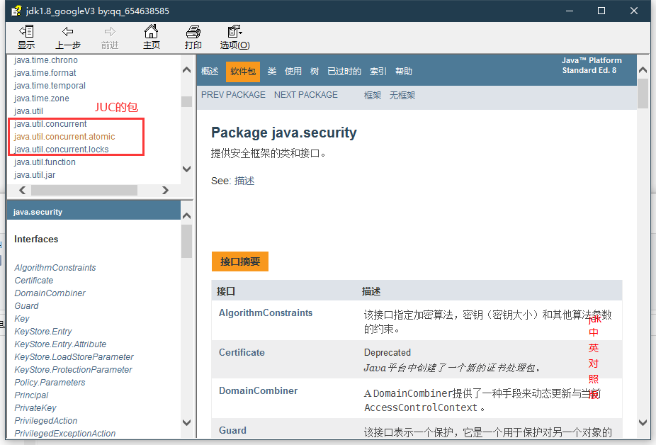

# JUC基础

## 并发与并行

* 并发:cpu一核,模拟出来多条线程,快速交替
* 并行:多个cpu同时执行;可以使用线程池

并发编程的本质 ==充分利用cpu==

## 获取cpu的核数

```java
class Test {
  public static void main(String[] args) {
    //查看本机是几核的cpu
    //cpu密集型,io密集型
    System.out.println(Runtime.getRuntime().availableProcessors());
  }
}

```

## 线程有几个状态 ---6

```java
//新生
NEW,

//运行
        RUNNABLE,

//阻塞
        BLOCKED,

//等待
        WAITING,

//有时间的等待
        TIMED_WAITING,

//终止
        TERMINATED;
```

## wait.sleep的区别

* 来自不同的类
    * wait=>Object
    * sleep=>thead
* 关于锁的释放
    * wait会释放锁
    * sleep睡着了,抱着锁睡觉,不会释放
* 范围
    * wait必须在同步代码块中
    * sleep可以在任何地方睡

## ==Lock锁==

### 传统Synchronized

```java
/**
 * 基本的买票例子
 * 公司中的开发
 * 线程就是一个单独的资源类,没有任何的附属操作!
 * 1.属性.方法
 */
public class SaleTicketDemo01 {
    public static void main(String[] args) {
        //并发,多个线程操作同一个资源类,
        Ticket ticket = new Ticket();

        // @FunctionalInterface 函数式接口
        new Thread(() -> {
            for (int i = 0; i < 60; i++) {
                ticket.sale();
            }
        }, "A").start();

        new Thread(() -> {
            for (int i = 0; i < 60; i++) {
                ticket.sale();
            }
        }, "B").start();

        new Thread(() -> {
            for (int i = 0; i < 60; i++) {
                ticket.sale();
            }
        }, "C").start();
    }
}

//使用oop,要是实现Runnable,就不是纯对象,耦合性增加
class Ticket {
    //初始票数
    private int number = 50;

    //卖票
    //synchronized 本质就是排队  synchronized锁对象或者class
    public synchronized void sale() {
        if (number > 0) {
            System.out.println(Thread.currentThread().getName() + "卖出了" + (number--) + "张票" + "---剩余了" + number + "张票");
        }

    }
}
```

### 使用JUC方式

#### lock锁介绍

> 核心方法

java.util.concurrent.locks类中


> 实现类

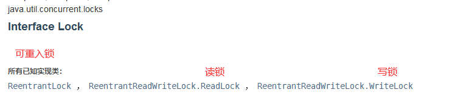

> ReentrantLock的构造方法

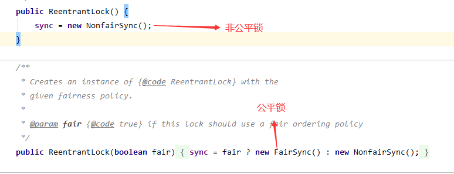

* 公平锁--->     十分公平,先来后到
* 非公平锁--->  **不公平,可以插队(默认)**

#### **使用方法**

> 其余不变

```java
package com.test.dome01;

import java.util.concurrent.locks.Lock;
import java.util.concurrent.locks.ReentrantLock;

public class SaleTicketD_Lock {

  public static void main(String[] args) {
    //并发,多个线程操作同一个资源类,
    Ticket ticket = new Ticket();
    new Thread(() -> {
      for (int i = 0; i < 60; i++) ticket.sale();
    }, "A");
    new Thread(() -> {
      for (int i = 0; i < 60; i++) ticket.sale();
    }, "B");
    new Thread(() -> {
      for (int i = 0; i < 60; i++) ticket.sale();
    }, "C");
  }
}

//使用oop,要是实现Runnable,就不是纯对象,耦合性增加
class Ticket2 {
  //初始票数
  private int number = 50;

  //lock锁
  Lock lock = new ReentrantLock();

    //卖票
    public void sale() {
        lock.lock();  //加锁
        try {
            //业务代码
            if (number > 0) {
                System.out.println(Thread.currentThread().getName() + "卖出了"
                        + (number--) + "张票" + "---剩余了" + number + "张票");
            }
        } catch (Exception e) {
            e.printStackTrace();
        } finally {
            lock.unlock();
        }

    }
}
```

### 总结

* Synchronized 内置的java关键字,Lock是一个java类

* Synchronized 无法判断获取锁的状态,Lock可以判断是否获取到了锁

* Synchronized 会自动释放锁,lock必须要手动释放(不释放就会产生死锁)

* Synchronized 公平锁,lock,不会一直等待->非公平锁

* Synchronized 可重入锁,不可中断,LOck,可重入锁,

* Synchronized 适合少用的代码,Lock适合锁大量额同步代码

*

# ==生产者和消费者问题(Lock)==

### 传统Synchronized方法

```java
 this.wait(); //线程等待
        this.notify(); //唤醒
```

> 判断等待,业务,通知

```java
class Test {
  private int number = 0;

  public synchronized void increment() throws
          InterruptedException {
    while (number != 0) {
      this.wait();
    }
    number++;
    System.out.println(Thread.currentThread()
            .getName() + "=->" + number);
    // 通知其他线程
    this.notify();
  }

  public synchronized void decrement()
          throws InterruptedException {
    while (number == 0) {
      this.wait();
    }
    number--;
    System.out.println(Thread.currentThread()
            .getName() + "=->" + number);
    // 通知其他线程
    this.notify();
  }
}
```

> 在判断中使用while判断,如果使用if判断会产生虚假唤醒

==虚假唤醒==

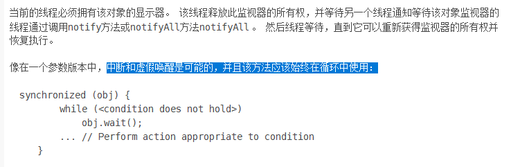

### ==用JUC方式==

```java
class data01 {
  private int number = 0;
  Lock lock = new ReentrantLock();
  Condition condition = lock.newCondition();

  public void increment() {
    lock.lock();
    try {
      while (number != 0) {
        condition.await();
      }
      number++;
      System.out.println(Thread.currentThread().getName() + "=->" + number);
      // 通知其他线程
      condition.signal();
    } catch (Exception e) {
      e.printStackTrace();
    } finally {
      lock.unlock();
    }
  }

  public void decrement() {
    lock.lock();
    try {
      while (number == 0) {
        condition.await();
      }
      number--;
      System.out.println(Thread.currentThread().getName() + "=->" + number);
      // 通知其他线程
      condition.signal();
    } catch (Exception e) {
      e.printStackTrace();
    } finally {
      lock.unlock();
    }
  }
}
```

```java
 notFull.await();  //阻塞
        notEmpty.signal(); //通知
```

### 传统与JUC对比

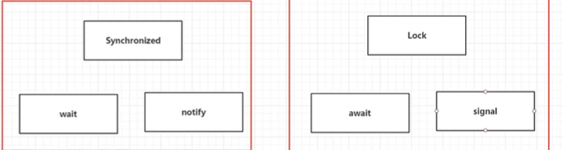

### 用JUC依次执行

> 可以开启多个Condition监视方法

```java
class DataC {
  private Lock lock = new ReentrantLock();
  private Condition condition1 = lock.newCondition();
  private Condition condition2 = lock.newCondition();
  private Condition condition3 = lock.newCondition();
  private int number = 1;

  public void a1() {
    lock.lock();
    try {
      while (number != 1) {
        condition1.await();
      }
      System.out.println(Thread.currentThread().getName() + "AAAAA");
      number++;
      condition2.signal();
    } catch (Exception e) {
      e.printStackTrace();
    } finally {
      lock.unlock();
    }
  }

  public void a2() {
    lock.lock();
    try {
      while (number != 2) {
        condition2.await();
      }
      System.out.println(Thread.currentThread().getName() + "BBBBB");
      number++;
      condition3.signal();
    } catch (Exception e) {
      e.printStackTrace();
    } finally {
      lock.unlock();
    }
  }

  public void a3() {
    lock.lock();
    try {
      while (number != 3) {
        condition3.await();
      }
      System.out.println(Thread.currentThread().getName() + "CCCCC");
      number = 1;
      condition1.signal();
    } catch (Exception e) {
      e.printStackTrace();
    } finally {
      lock.unlock();
    }
  }
}
```

### 8锁现象

* 如何判断锁的是谁?锁的是谁

    * Sychornized 在方法上,锁的是调用的对象
    * Sychornized 修饰加了static的方法上,--锁的是类--,俩个对象的class类模板只有一个,所以会同步

# 集合类不安全

## list

> 解决方案

```java
/**
 * 并发情况下出现的错误 Exception in thread "5" java.util.ConcurrentModificationException
 *
 * <p>1. List<String>list = new Vector<>();
 *
 * <p>2. List<String> list = Collections.synchronizedList(new ArrayList<>());
 *
 * <p>3. List<String> list = new CopyOnWriteArrayList<>();
 */
// CopyOnWrite 写入时复制   CopyOnWriteArrayList比Vector厉害在哪里?    用的lock锁
class Test {
  public static void main(String[] args) {
    List<String> list = new CopyOnWriteArrayList<>();
    for (int i = 1; i <= 50; i++) {
      new Thread(
              () -> {
                list.add(UUID.randomUUID().toString().substring(0, 5));
                System.out.println(list);
              },
              String.valueOf(i))
              .start();
    }
  }
}
```

## Set

> 解决方案

```java
/**
 * Exception in thread "A" java.util.ConcurrentModificationException
 *
 * <p>1.Collections.synchronizedSet(new HashSet<>());
 *
 * <p>2. Set<String> set = new CopyOnWriteArraySet<>();
 */
Set<String> set=new CopyOnWriteArraySet<>();
        for(int i=0;i< 50;i++){
        new Thread(
        ()->{
        set.add(UUID.randomUUID().toString().substring(0,5));
        System.out.println(set);
        },
        "A")
        .start();
        }
```

### set本质

> set的add方法

```java
 private transient HashMap<E, Object> map;
/**
 * Adds the specified element to this set if it is not already present.
 * More formally, adds the specified element <tt>e</tt> to this set if
 * this set contains no element <tt>e2</tt> such that
 * <tt>(e==null&nbsp;?&nbsp;e2==null&nbsp;:&nbsp;e.equals(e2))</tt>.
 * If this set already contains the element, the call leaves the set
 * unchanged and returns <tt>false</tt>.
 *
 * @param e element to be added to this set
 * @return <tt>true</tt> if this set did not already contain the specified
 * element
 */
public boolean add(E e){
        return map.put(e,PRESENT)==null;
        }
```

## map

> 默认加载

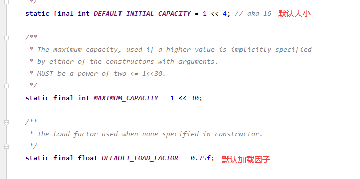

#### 解决并发状况

```java
/**
 * Exception in thread "A" java.util.ConcurrentModificationException
 *
 * <p>1.Map<String, String> map = Collections.synchronizedMap(new HashMap<>());
 *
 * <p>2.  Map<String, String> map = new ConcurrentHashMap<>();
 */
    Map<String, String> map=new ConcurrentHashMap<>();
        for(int i=0;i< 50;i++){
        new Thread(
        ()->{
        map.put(
        Thread.currentThread().getName(),UUID.randomUUID().toString().substring(0,5));
        System.out.println(map);
        },
        String.valueOf(i))
        .start();
        }
```

# Callable

## 介绍

* Callable接口类似于Runnable ，因为它们都是为其实例可能由另一个线程执行的类设计的。 然而，Runnable不返回结果，也不能抛出被检查的异常。
* 该Executors类包含的实用方法，从其他普通形式转换为Callable类。

区别:

1.可以有返回值

2.可以抛出异常

3.方法不同,run() /call()

## 关系

==在Runnable中有个实现类,FutureTask,FutureTask中构造方法可以放Callable==

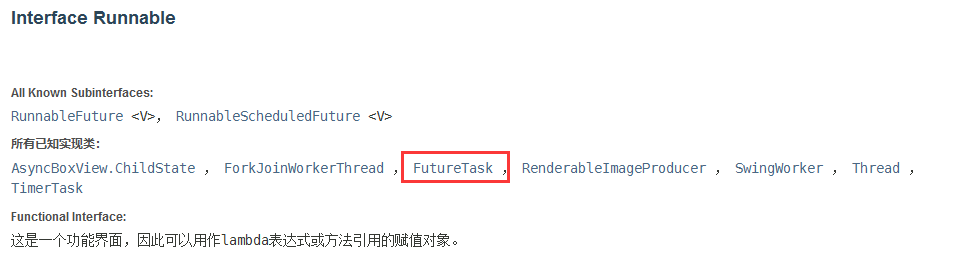

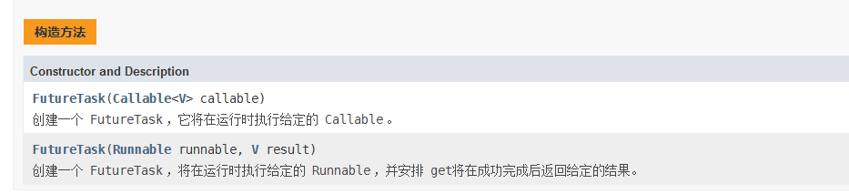

## 使用方法

```java

class MyCllable implements Callable<Integer> {

  public static void main(String[] args) throws ExecutionException, InterruptedException {
    MyCllable myCllable = new MyCllable();
    FutureTask futureTask = new FutureTask<>(myCllable); // 适配器
    new Thread(futureTask, "A").start();
    new Thread(futureTask, "B").start(); //会有缓存,效率高
    Integer o = (Integer) futureTask.get(); // get可能会有阻塞,放最后或者通过异步请求
    System.out.println(o);
  }

  @Override
  public Integer call() throws Exception {
    System.out.println("call()-------------");
    return 123456;
  }
}
```

# 常用辅助类

## CountDownLatch

### 介绍

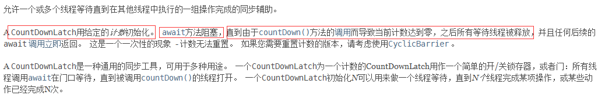

### 用法

```java
CountDownLatch countDownLatch=new CountDownLatch(10); //初始值是多少就必须执行多少次才能往下继续
        for(int i=0;i< 10;i++){
        new Thread(()->{
        System.out.println(Thread.currentThread().getName()+" GO out");
        countDownLatch.countDown(); //没执行一次就-1
        },String.valueOf(i)).start();
        }
        countDownLatch.await(); //没执行完就等待
        System.out.println("关门!");
```

### 核心思想

必须到达给予的值时,才会向下执行

## CyclicBarrier

### 介绍

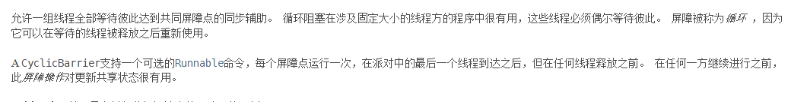

### 用法

```java
CyclicBarrier cyclicBarrier=new CyclicBarrier(7,()->{
        System.out.println("神龙出来了!");
        });

        for(int i=0;i< 7;i++){
final Integer temp=i;
        new Thread(()->{
        System.out.println("收集了"+Thread.currentThread().getName()+"颗龙珠");
        try{
        cyclicBarrier.await();
        }catch(InterruptedException e){
        e.printStackTrace();
        }catch(BrokenBarrierException e){
        e.printStackTrace();
        }
        },
        String.valueOf(i)).start();
        }
        }
```

### 核心思想

在创建CyclicBarrier时可以放一条线程,只有到达给与的值时,执行放入的线程

## Semaphore.

### 介绍


### 用法

```java
Semaphore semaphore=new Semaphore(5);
        for(int i=0;i< 10;i++){
        new Thread(()->{
        try{
        semaphore.acquire(); // 得到
        System.out.println(Thread.currentThread().getName()+"得到了停车位!");
        TimeUnit.SECONDS.sleep(3);
        System.out.println(Thread.currentThread().getName()+"走了!");
        }catch(InterruptedException e){
        e.printStackTrace();
        }finally{
        semaphore.release(); // 释放
        }
        },
        String.valueOf(i))
        .start();
        }
        }
```

### 总结

Semaphore

semaphore.acquire(); //得到 只有得到才能运行,一共只能同时运行给与的大小

semaphore.release(); // 释放 只有释放了下面的才能得到

# ReadWriteLock(读写锁)

## 介绍

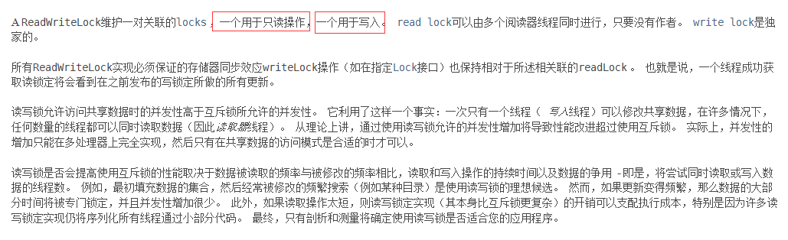

ReadWriteLock readWriteLock = new ReentrantReadWriteLock(); 创建

readWriteLock.writeLock().lock(); 开启写入锁

readWriteLock.readLock().lock(); 开启读取锁

用法跟lock一样

## 用法

```java
public static void main(String[]args){
        MyCache myCache=new MyCache();

        // 写入
        for(int i=0;i< 10;i++){
final int temp=i;
        new Thread(()->{
        myCache.put(temp+"",temp+"");
        },String.valueOf(i)).start();
        }

        // 读取
        for(int i=0;i< 10;i++){
final int temp=i;
        new Thread(()->{
        myCache.get(temp+"");
        },String.valueOf(i)).start();
        }
        }


class MyCache {
  private Map<String, Object> map = new HashMap<>();
  private ReadWriteLock readWriteLock = new ReentrantReadWriteLock();

  //模拟缓存的写入
  public void put(String key, String value) {
    readWriteLock.writeLock().lock();
    try {
      System.out.println("开始写入" + Thread.currentThread().getName());
      map.put(key, value);
      System.out.println(Thread.currentThread().getName() + "写入OK!");
    } catch (Exception e) {
      e.printStackTrace();
    } finally {
      readWriteLock.writeLock().unlock();
    }
  }

  //模拟缓存的读取
  public void get(String key) {
    readWriteLock.readLock().lock();
    try {
      System.out.println("开始读取" + Thread.currentThread().getName());
      map.get(key);
      System.out.println(Thread.currentThread().getName() + "读取成功!");
    } catch (Exception e) {
      e.printStackTrace();
    } finally {
      readWriteLock.readLock().unlock();
    }
  }
}
```

# 阻塞队列

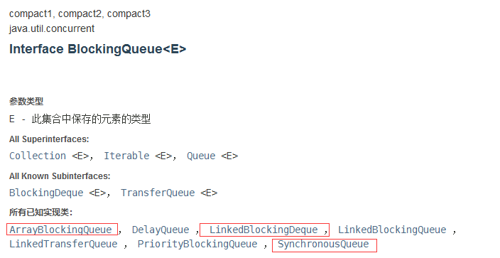

## 四组API

| 方法 | 有异常     | 无异常   | 阻塞   | 超时等待 |
|----|---------|-------|------|------|
| 添加 | add     | offer | put  |      |
| 移除 | remove  | poll  | take |      |
| 队首 | element | peek  | ...  | ...  |

### 有异常

```java
 /** 有异常 */
public static void t1(){
        ArrayBlockingQueue<Object> objects=new ArrayBlockingQueue<>(3);
        System.out.println(objects.add("a"));
        System.out.println(objects.add("b"));
        System.out.println(objects.add("c"));
        //System.out.println(objects.add("d")); 抛出异常
        System.out.println("----------------");

        // 先进先出
        System.out.println(objects.remove());
        System.out.println(objects.remove());
        System.out.println("队首"+objects.element()); // 判断当前队首
        System.out.println(objects.remove());
        // System.out.println(objects.remove()); 抛出异常
        }
```

### 无异常

```java
 /** 无异常 */
public static void t2(){
        ArrayBlockingQueue<Object> objects=new ArrayBlockingQueue<>(3);
        System.out.println(objects.offer("a"));
        System.out.println(objects.offer("b"));
        System.out.println(objects.offer("c"));
        //System.out.println(objects.offer("d"));  返回false
        System.out.println("----------------------");

        System.out.println(objects.poll());
        System.out.println(objects.poll());
        //System.out.println(objects.poll());  返回null
        System.out.println("队首"+objects.peek()); // 队首
        System.out.println(objects.poll());
        }
```

### 阻塞

```java
/**
 * 阻塞
 *
 * @throws InterruptedException
 */
public static void t3()throws InterruptedException{
        ArrayBlockingQueue<Object> objects=new ArrayBlockingQueue<>(3);
        objects.put("a");
        objects.put("b");
        objects.put("c");
        // objects.put("d");  会一直等待下去
        System.out.println("----------------");
        System.out.println(objects.take());
        System.out.println(objects.take());
        System.out.println(objects.take());
        // System.out.println(objects.take());会一直等待下去
        }
```

### 超时等待

```java
/**
 * 超时等待
 * @throws InterruptedException
 */
public static void t4()throws InterruptedException{
        ArrayBlockingQueue<Object> objects=new ArrayBlockingQueue<>(3);
        objects.offer("a");
        objects.offer("b");
        objects.offer("c");
        // objects.offer("d",2, TimeUnit.SECONDS); 等待2秒

        System.out.println("-----------------");

        System.out.println(objects.poll());
        System.out.println(objects.poll());
        System.out.println(objects.poll());
        // objects.poll(2, TimeUnit.SECONDS);等待2秒
        }
```

## SynchronousQueue

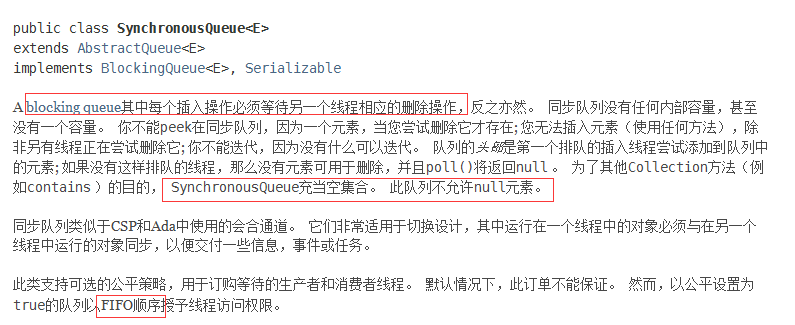

### 用法

```java
class Test {
  public static void t1() {
    SynchronousQueue<Object> objects = new SynchronousQueue<>();
    new Thread(() -> {
      try {
        System.out.println(Thread.currentThread().getName() + "a");
        objects.put("a");
        System.out.println(Thread.currentThread().getName() + "b");
        objects.put("b");
        System.out.println(Thread.currentThread().getName() + "c");
        objects.put("c");
      } catch (InterruptedException e) {
        e.printStackTrace();
      }
    }, "A").start();

    new Thread(() -> {
      try {
        System.out.println(Thread.currentThread().getName() + "->"
                + objects.take());
        System.out.println(Thread.currentThread().getName() + "->"
                + objects.take());
        System.out.println(Thread.currentThread().getName() + "->"
                + objects.take());
      } catch (InterruptedException e) {
        e.printStackTrace();
      }
    }, "b").start();
  }
}
```

# ==线程池==

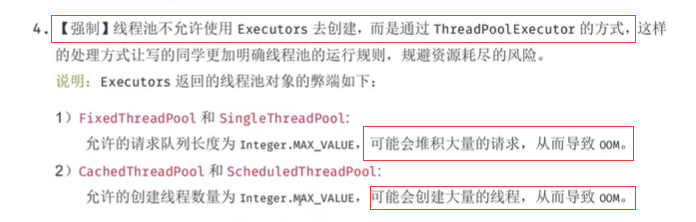

## 好处

* 减少资源
* 提高性能
* 方便管理

**==线程复用,控制并发,方便管理==**

## 三大方法

```java
/**
 * 线程池的三大方法
 *
 * @author 一个小小卒
 * @param args
 */
public static void main(String[]args){
        ExecutorService executorService2=Executors.newSingleThreadExecutor(); // 单个线程池
        ExecutorService executorService1=Executors.newFixedThreadPool(5); // 指定线程池
        ExecutorService executorService=Executors.newCachedThreadPool(); // 带缓存额线程池,有收缩性
        try{
        for(int i=0;i< 10;i++){
        executorService1.execute(
        ()->{
        System.out.println(Thread.currentThread().getName()+"------------");
        });
        }
        }catch(Exception e){
        e.printStackTrace();
        }finally{
        // 必须关闭线程
        executorService.shutdown();
        }
        }
```

## 七大参数

### 源码分析

```java
public static ExecutorService newSingleThreadExecutor(){
        return new FinalizableDelegatedExecutorService
        (new ThreadPoolExecutor(1,1,
        0L,TimeUnit.MILLISECONDS,
        new LinkedBlockingQueue<Runnable>()));
        }

public static ExecutorService newFixedThreadPool(int nThreads){
        return new ThreadPoolExecutor(nThreads,nThreads,
        0L,TimeUnit.MILLISECONDS,
        new LinkedBlockingQueue<Runnable>());
        }

public static ExecutorService newCachedThreadPool(){
        return new ThreadPoolExecutor(0,Integer.MAX_VALUE, //大概21亿
        60L,TimeUnit.SECONDS,
        new SynchronousQueue<Runnable>());
        }

//本质就是调用ThreadPoolExecutor,就是用的this有参构造

public ThreadPoolExecutor(int corePoolSize, //核心线程池大小
        int maximumPoolSize,//最大参数
        long keepAliveTime,    //TimeUnit参数
        TimeUnit unit,        //TimeUnit单位
        BlockingQueue<Runnable> workQueue, // BlockingQueue消息队列
        ThreadFactory threadFactory,    //线程工厂
        RejectedExecutionHandler handler //拒绝策略) {
        if(corePoolSize< 0||
        maximumPoolSize<=0||
        maximumPoolSize<corePoolSize ||
        keepAliveTime< 0)
        throw new IllegalArgumentException();
        if(workQueue==null||threadFactory==null||handler==null)
        throw new NullPointerException();
        this.corePoolSize=corePoolSize;
        this.maximumPoolSize=maximumPoolSize;
        this.workQueue=workQueue;
        this.keepAliveTime=unit.toNanos(keepAliveTime);
        this.threadFactory=threadFactory;
        this.handler=handler;
        }
```

## 自定义线程池

```java
{
        ThreadPoolExecutor threadPoolExecutor=
        new ThreadPoolExecutor(
        3,
        5,
        2,
        TimeUnit.SECONDS,
        new ArrayBlockingQueue<>(3),
        Executors.defaultThreadFactory(),
        new ThreadPoolExecutor.DiscardPolicy());

        try{
        for(int i=0;i< 10;i++){
        threadPoolExecutor.execute(
        ()->{
        System.out.println(Thread.currentThread().getName()+"  !!!");
        });
        }
        }catch(Exception e){
        e.printStackTrace();
        }finally{
        threadPoolExecutor.shutdown();
        }
        }
```

## 4种拒绝策略

```java
/**
 * 自定义线程池 拒绝策略
 *
 * <p>new ThreadPoolExecutor.AbortPolicy() 列队满了.会抛出异常
 *
 * <p>new ThreadPoolExecutor.CallerRunsPolicy() 列队满了.多的会打发回去,这里是交给main线程去执行
 *
 * <p>new ThreadPoolExecutor.DiscardOldestPolicy() 列队满了.和最早的的竞争,不会抛出异常
 *
 * <p>new ThreadPoolExecutor.DiscardPolicy() 列队满了.直接丢掉任务
 */
```

## 最大线程池的设置

```
    /** 设置最大池有俩种方式:
     * 1.cup密集型: 用cpu的最大核数
     * 2.io密集型  > 最耗资源的线程  
     * 获取cup核数:Runtime.getRuntime().availableProcessors()
     * */
```

# 四大函数式接口

## function

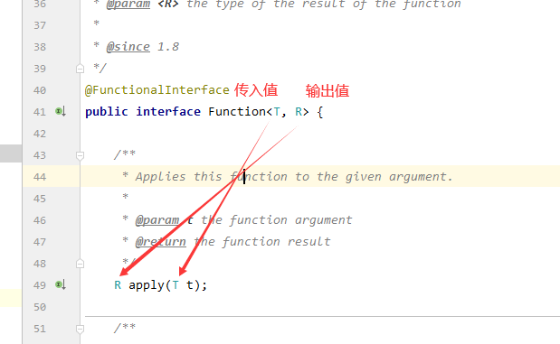

```java
/**
 * 函数式接口,输入一个值,输出一个值
 *
 * @param args
 */
public static void main(String[]args){
        Function<String, String> function=
        (v)->{
        return v;
        };
        System.out.println(function.apply("123"));
        }
```

## predicate

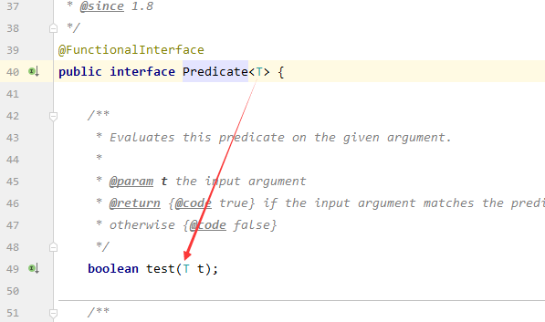

```java
/**
 * 断言式接口,传入一个值,返回一个布尔值
 *
 * @param args
 */
public static void main(String[]args){
        Predicate<String> predicate=
        (v)->{
        return v.isEmpty();
        };
        System.out.println(predicate.test("123"));
        }
```

## Consumer

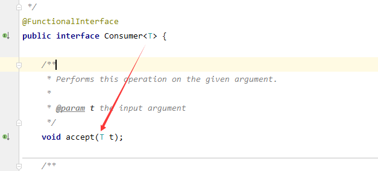**

```java
/**
 * 消费者:只有参数,没有返回值
 *
 * @param args
 */
public static void main(String[]args){
        Consumer<String> objectConsumer=
        (v)->{
        System.out.println(v);
        };

        objectConsumer.accept("asd");
        }
```

## Supplier

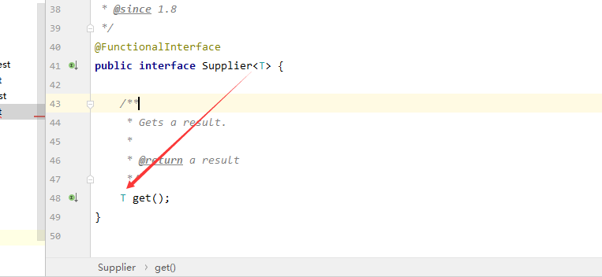

```java
/**
 * 供给着:无参数,有返回值
 *
 * @param args
 */
public static void main(String[]args){
        Supplier<String> supplier=
        ()->{
        return"v";
        };

        System.out.println(supplier.get());
        }
```

# ==Stream==

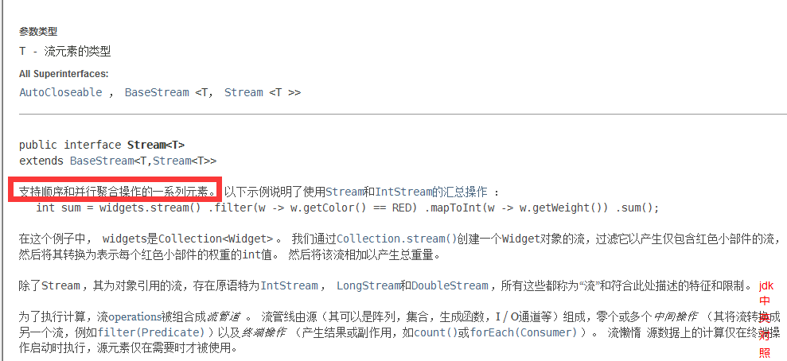

```java
public class StreamTest {
  public static void main(String[] args) {
    User user = new User("a", '男', 10);
    User user1 = new User("b", '女', 23);
    User user2 = new User("c", '男', 4);
    User user3 = new User("d", '男', 30);
    List<User> list = Arrays.asList(user, user1, user2, user3);

    list.stream()
            .filter((v) -> {
              return '男' == v.getSex();
            })     //predicate
            .filter((v) -> {
              return 8 < v.getAge();
            })
            .map((v) -> {
              return v.getName().toUpperCase();
            })    //Function
            .sorted((v1, v2) -> {
              return v1.compareTo(v2);
            })  //int compare(T o1, T o2);
            .forEach(System.out::println);
    ;
  }
}

@Data
class User {
  private String name;
  private char sex;
  private Integer age;
}
```

## ==扩展(jdk8新特性)==

```java
package com.test.forkjoin;

import org.junit.Test;

import java.util.OptionalLong;
import java.util.concurrent.ExecutionException;
import java.util.concurrent.ForkJoinPool;
import java.util.concurrent.ForkJoinTask;
import java.util.concurrent.RecursiveTask;
import java.util.stream.LongStream;

public class Dome01 extends RecursiveTask<Long> {

  private Long start;
  private Long end;

  private Long temp = 1_0000L;

  public Dome01(long start, long end) {
    this.start = start;
    this.end = end;
  }

  @Override
  protected Long compute() {
    if (temp > (end - start)) {
      Long sum = 0L;
      for (long i = start; i < end; i++) {
        sum += i;
      }
      return sum;
    } else {
      Long middel = (start + end) / 2; // 拆分成俩个任务
      Dome01 task1 = new Dome01(start, middel);
      task1.fork();
      Dome01 task2 = new Dome01(middel + 1, end);
      task2.fork();
      return task1.join() + task2.join();
    }
  }

  public static void main(String[] args) throws ExecutionException, InterruptedException {
    t1(); // 总时间为:3485
    System.out.println("------------");
    t2(); // 总时间为:5632
    System.out.println("------------");
    t3();
  }

  /**
   * 用ForkJoin执行
   *
   * @throws ExecutionException
   * @throws InterruptedException
   */
  public static void t1() throws ExecutionException, InterruptedException {
    long x = System.currentTimeMillis();
    System.out.println(x);

    ForkJoinPool forkJoinPool = new ForkJoinPool();
    ForkJoinTask<Long> start = new Dome01(0L, 10_0000_0000L);
    //    forkJoinPool.execute(dome01); //只执行,没有结果
    ForkJoinTask<Long> submit = forkJoinPool.submit(start);
    Long aLong = submit.get();
    System.out.println(aLong);

    long x1 = System.currentTimeMillis();
    System.out.println(x1);

    System.out.println("t1()总时间为:" + (x1 - x));
  }

  /** 用传统方式执行 */
  public static void t2() {
    long x = System.currentTimeMillis();
    System.out.println(x);

    Long sum = 0L;
    for (long i = 0; i < 10_0000_0000L; i++) {
      sum += i;
    }
    System.out.println("结果为:" + sum);
    long x1 = System.currentTimeMillis();
    System.out.println(x1);

    System.out.println("t2()总时间为:" + (x1 - x));
  }

  /** 用Stream方式 */
  public static void t3() {
    long x = System.currentTimeMillis();
    System.out.println(x);

    OptionalLong reduce = LongStream.range(0L, 10_0000_0000L).parallel().reduce(Long::sum);
    long asLong = reduce.getAsLong();
    System.out.println(asLong);

    long x1 = System.currentTimeMillis();
    System.out.println(x1);

    System.out.println("t2()总时间为:" + (x1 - x));
  }
}
```

# Forkjoin

==核心==

> 把大型任务拆分成多个小任务

特点:工作窃取 --------------自行百度

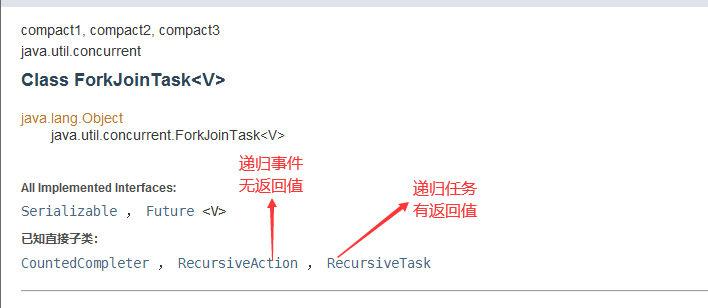

```java
public class Dome01 extends RecursiveTask<Long> {

  private Long start;
  private Long end;

  private Long temp = 1_0000L;

  public Dome01(long start, long end) {
    this.start = start;
    this.end = end;
  }

  @Override
  protected Long compute() {
    if (temp > (end - start)) {
      Long sum = 0L;
      for (long i = start; i < end; i++) {
        sum += i;
      }
      return sum;
    } else {
      Long middel = (start + end) / 2; // 拆分成俩个任务
      Dome01 task1 = new Dome01(start, middel);
      task1.fork();
      Dome01 task2 = new Dome01(middel + 1, end);
      task2.fork();
      return task1.join() + task2.join();
    }
  }


  /**
   * 用ForkJoin执行
   *
   * @throws ExecutionException
   * @throws InterruptedException
   */
  public static void t1() throws ExecutionException, InterruptedException {
    long x = System.currentTimeMillis();
    System.out.println(x);

    ForkJoinPool forkJoinPool = new ForkJoinPool();
    ForkJoinTask<Long> start = new Dome01(0L, 10_0000_0000L);
    //    forkJoinPool.execute(dome01); //只执行,没有结果
    ForkJoinTask<Long> submit = forkJoinPool.submit(start);
    Long aLong = submit.get();
    System.out.println(aLong);

    long x1 = System.currentTimeMillis();
    System.out.println(x1);

    System.out.println("t1()总时间为:" + (x1 - x));
  }
```

# 异步通信(Future)

```java
 public static void main(String[]args)throws ExecutionException,InterruptedException{
        t1();
        t2();
        }

/**
 * 无返回值
 *
 * @throws ExecutionException
 * @throws InterruptedException
 */
public static void t1()throws ExecutionException,InterruptedException{
        CompletableFuture<Void> completableFuture=
        CompletableFuture.runAsync(
        ()->{
        try{
        TimeUnit.SECONDS.sleep(2);
        System.out.println(Thread.currentThread().getName()+"completableFuture=>void");
        }catch(InterruptedException e){
        e.printStackTrace();
        }
        });

        System.out.println("123456");
        System.out.println(completableFuture.get()); // 获取结果
        }

/**
 * 有返回值
 *
 * @throws ExecutionException
 * @throws InterruptedException
 */
public static void t2()throws ExecutionException,InterruptedException{
        CompletableFuture<Integer> completableFuture=
        CompletableFuture.supplyAsync(
        ()->{
        System.out.println(Thread.currentThread().getName()+"completableFuture=>Integer");
        return 1024;
        });

        System.out.println(
        completableFuture
        .whenComplete(
        (o,n)->{
        System.out.println("o->"+o);
        System.out.println("n->"+n);
        })
        .exceptionally(
        (e)->{
        System.out.println(e.getMessage());
        return 500;
        })
        .get());
        }
```

# Volatile

## ==JMM三大特性==

可见性

**==不保证原子性==**

禁止指令重排

## JMM关于同步的规定

1.线程解锁前，必须把共享变量的值刷新回主内存；

2.线程加锁前，必须读取主内存的最新值到自己的工作内存；

3.加锁解锁是同一把锁；

Java内存模型抽象图如下：


## 8种原子操作

- lock(锁定)：作用于主内存，它把一个变量标记为一条线程独占状态；
- read(读取)：作用于主内存，它把变量值从主内存传送到线程的工作内存中，以便随后的load动作使用；
- load(载入)：作用于工作内存，它把read操作的值放入工作内存中的变量副本中；
- use(使用)：作用于工作内存，它把工作内存中的值传递给执行引擎，每当虚拟机遇到一个需要使用这个变量的指令时候，将会执行这个动作；
- assign(赋值)：作用于工作内存，它把从执行引擎获取的值赋值给工作内存中的变量，每当虚拟机遇到一个给变量赋值的指令时候，执行该操作；
- store(存储)：作用于工作内存，它把工作内存中的一个变量传送给主内存中，以备随后的write操作使用；
- write(写入)：作用于主内存，它把store传送值放到主内存中的变量中。
- unlock(解锁)：作用于主内存，它将一个处于锁定状态的变量释放出来，释放后的变量才能够被其他线程锁定；

1、不允许read和load、store和write操作之一单独出现（即不允许一个变量从主存读取了但是工作内存不接受，或者从工作内存发起会写了但是主存不接受的情况），以上两个操作必须按顺序执行，但没有保证必须连续执行，也就是说，read与load之间、store与write之间是可插入其他指令的。
2、不允许一个线程丢弃它的最近的assign操作，即变量在工作内存中改变了之后必须把该变化同步回主内存。
3、不允许一个线程无原因地（没有发生过任何assign操作）把数据从线程的工作内存同步回主内存中。
4、一个新的变量只能从主内存中“诞生”，不允许在工作内存中直接使用一个未被初始化（load或assign）的变量，换句话说就是对一个变量实施use和store操作之前，必须先执行过了assign和load操作。
5、一个变量在同一个时刻只允许一条线程对其执行lock操作，但lock操作可以被同一个条线程重复执行多次，多次执行lock后，只有执行相同次数的unlock操作，变量才会被解锁。
6、如果对一个变量执行lock操作，将会清空工作内存中此变量的值，在执行引擎使用这个变量前，需要重新执行load或assign操作初始化变量的值。
7、如果一个变量实现没有被lock操作锁定，则不允许对它执行unlock操作，也不允许去unlock一个被其他线程锁定的变量。
8、对一个变量执行unlock操作之前，必须先把此变量同步回主内存（执行store和write操作）。

## 可见性

其中一条线程中改变值,另外一条线程获取不到改变过的值

```java
package com.test.tvolatile;

import java.util.concurrent.TimeUnit;

public class JMMDome {
  private static int flsg = 0;

  public static void main(String[] args) {
    new Thread(
            () -> {
              while (flsg == 0) {
                /*
                 System.out.println(Thread.currentThread().getName() + "->" + flsg);
                 只要在里面用flsg这个参数,该线程就会读取,循环就会结束
                */
              }
            },
            "A")
            .start();

    new Thread(
            () -> {
              try {
                TimeUnit.MILLISECONDS.sleep(1);
              } catch (InterruptedException e) {
                e.printStackTrace();
              }
              flsg = 1;
              System.out.println(Thread.currentThread().getName() + "->" + flsg);
            },
            "B")
            .start();

    System.out.println(Thread.currentThread().getName() + "->" + flsg);
  }
}

```

### 解决

解决思路用Volatile关键字,或者在里面get循环这个值就会刷新

* 在一条线程中改变这个值,另外一条线程不可见

```java
 private static volatile int flsg=0;
```

## 不保证原子性

解决方案:

使用lock和synchronized.如果不使用则用原子类解决问题,效率高,直接和操作系统挂钩

```java
package com.test.tvolatile;

import java.util.concurrent.atomic.AtomicInteger;

public class Dome02 {

  /** private static int sum = 0; 结果有问题,除了lock锁和synchronized外还有用原子性操作 */
  /**
   * 使用一个int可能原子更新的值,解决volatile原子性不一致的问题,
   *
   * <p>sum.getAndIncrement() 先获取值,再++ sum.decrementAndGet() 先--,在获取值
   *
   * <p>sum.getAndDecrement() 先获取值,再--
   */
  private static AtomicInteger sum = new AtomicInteger(0);

  public static void add() {
    System.out.println(sum.getAndIncrement());
  }

  public static void main(String[] args) {
    for (int i = 0; i < 100; i++) {
      new Thread(
              () -> {
                for (int j = 0; j < 1_0000; j++) {
                  add();
                }
              })
              .start();
    }

    while (Thread.activeCount() > 2) { // 判断当前有几条线程
      Thread.yield(); // 让所有线程变成为就绪状态
    }

    System.out.println(sum);
  }
}
```

==Unsafe unsafe = Unsafe.getUnsafe();==

## 禁止指令重排

> 指令重排

* 计算机不是按照自己写的顺序执行的
* 源代码=>编译器优化=>指令并行可能会重排=>内存系统可能会重排

指令重排在并发中,结果可能会产生错误!

> 源码:


> 计算机编译后:


### volatile避免指令重排原理

​ 在代码执行前后加上内存屏障

> 内存屏障在单例模式中很经典

# 单例模式

## 饿汉式

```java
package com.test.single;

/** 饿汉式单例 */
public class Hungry {
  private Hungry() {
  }

  private static final Hungry HUNGRY = new Hungry();

  private Hungry getInstance() {
    return HUNGRY;
  }
}

```

## 懒汉式(DCL)

```java
package com.test.single;

import java.lang.reflect.Constructor;
import java.lang.reflect.Field;
import java.net.SocketTimeoutException;

/** 懒汉式单例 */
public class LazyMan {
  // 不加volatile可能会造成指令排序问题,先分配内存,把对象指向内存后在初始化对象.就会返回一个null对象
  private static volatile LazyMan lazyMan;
  private Boolean flg = false;

  private LazyMan() {
    synchronized (LazyMan.class) {
      if (flg == false) {
        flg = true;
      } else {
        throw new RuntimeException("不要破坏单例");
      }
    }
  }

  private static LazyMan getInstance() {
    if (lazyMan == null) {
      synchronized (LazyMan.class) { // 在多线程下,不是单例,要加锁.就是DCL懒汉式
        if (lazyMan == null) {
          lazyMan = new LazyMan();
        }
      }
    }
    return lazyMan;
  }

```

## 使用反射破坏单例模式

```java
package com.test.single;

import java.lang.reflect.Constructor;
import java.lang.reflect.Field;
import java.net.SocketTimeoutException;

/** 懒汉式单例 */
public class LazyMan {
  // 不加volatile可能会造成指令排序问题,先分配内存,把对象指向内存后在初始化对象.就会返回一个null对象
  private static volatile LazyMan lazyMan;
  private Boolean flg = false;

  private LazyMan() {
    synchronized (LazyMan.class) {
      if (flg == false) {
        flg = true;
      } else {
        throw new RuntimeException("不要破坏单例");
      }
    }
  }

  private static LazyMan getInstance() {
    if (lazyMan == null) {
      synchronized (LazyMan.class) { // 在多线程下,不是单例,要加锁.就是DCL懒汉式
        if (lazyMan == null) {
          lazyMan = new LazyMan();
        }
      }
    }
    return lazyMan;
  }

  /**
   * 这种懒汉式会造成用反射破坏
   *
   * @param args
   */
  public static void main(String[] args) throws Exception {
    Field flg = LazyMan.class.getDeclaredField("flg");
    flg.setAccessible(true);

    Constructor<LazyMan> declaredConstructor = LazyMan.class.getDeclaredConstructor(null);
    declaredConstructor.setAccessible(true);

    LazyMan lazyMan1 = declaredConstructor.newInstance();

    flg.set(lazyMan1, false); // 把值设置为false又成功破坏单例

    LazyMan lazyMan2 = declaredConstructor.newInstance();

    System.out.println(lazyMan1);
    System.out.println(lazyMan2); // 成功破坏单例模式
  }
}

```

## 总结:

> 使用枚举创建单例模式

## 补充枚举类的简单使用:

```java
package com.test.single;

public enum MyEnum {
  asd(0, "123"),
  qwe(1, "432"),
  zxc(2, "5634");
  private String name;
  private int age;

  MyEnum(int i, String s) {
    this.age = i;
    this.name = s;
  }

  public String getName() {
    return name;
  }

  public void setName(String name) {
    this.name = name;
  }

  public int getAge() {
    return age;
  }

  public void setAge(int age) {
    this.age = age;
  }

  @Override
  public String toString() {
    return "MyEnum{" + "name='" + name + '\'' + ", age=" + age + '}';
  }
}

class t {
  public static void main(String[] args) {
    MyEnum[] values = MyEnum.values();
    for (MyEnum value : values) {
      System.out.println(value);
    }
    System.out.println();
    MyEnum myEnum = MyEnum.valueOf("asd");
    System.out.println(myEnum);
  }
}

```

# CAS

> ​ 比较并交换

```java
package com.test.cas;

import java.util.concurrent.atomic.AtomicInteger;

public class Dome {
  public static void main(String[] args) {
    AtomicInteger atomicInteger = new AtomicInteger();
    /** expect 期望值,update更新.当达到期望值时,更新这个值 */
    System.out.println(atomicInteger.compareAndSet(0, 500));
    System.out.println(atomicInteger.get());
  }
}

```

> 缺点

* 由于底层是自旋锁,浪费时间
* 一次只能保证一个共享变量
* ABA问题

> ABA

==狸猫换太子==

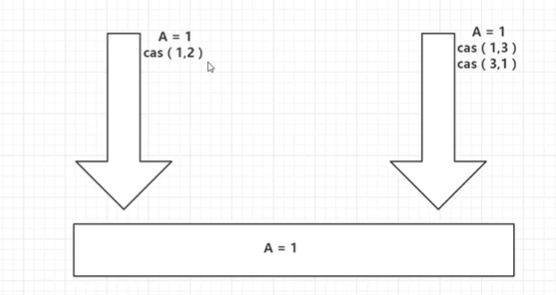

解决方法:参考==原子引用==

## Unsafe类

> ​ 用来操作计算机底层的

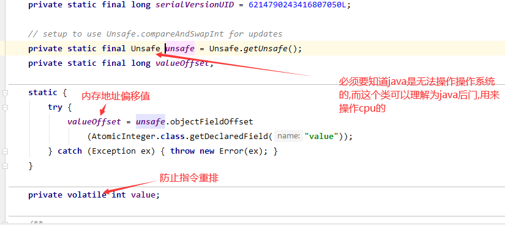

## 原子引用

> 引用类型坑

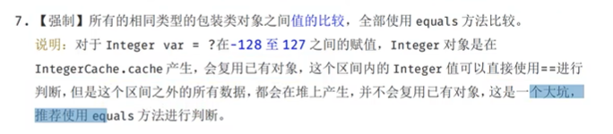

> api

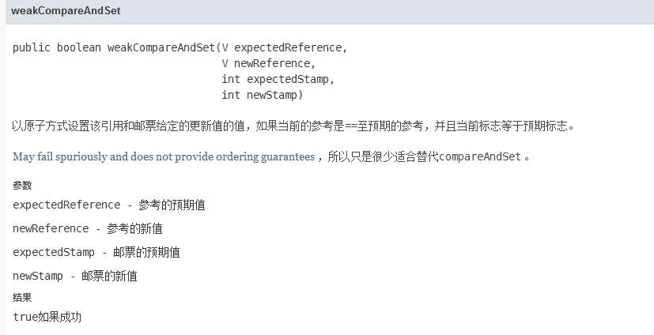

```java
package com.test.cas;

import java.sql.Time;
import java.util.concurrent.TimeUnit;
import java.util.concurrent.atomic.AtomicStampedReference;

public class ABA {
  public static void main(String[] args) throws InterruptedException {
    AtomicStampedReference<Integer> atomicStampedReference = new AtomicStampedReference<>(1, 1);
    new Thread(
            () -> {
              System.out.println(
                      Thread.currentThread().getName() + "=>" + atomicStampedReference.getStamp());
              try {
                TimeUnit.SECONDS.sleep(1);
              } catch (InterruptedException e) {
                e.printStackTrace();
              }

              System.out.println(
                      Thread.currentThread().getName()
                              + "=>"
                              + atomicStampedReference.getStamp()
                              + ",结果:"
                              + atomicStampedReference.compareAndSet(
                              1,
                              2,
                              atomicStampedReference.getStamp(),
                              atomicStampedReference.getStamp() + 1));
              System.out.println(
                      Thread.currentThread().getName()
                              + "=>"
                              + atomicStampedReference.getStamp()
                              + ",结果:"
                              + atomicStampedReference.compareAndSet(
                              2,
                              1,
                              atomicStampedReference.getStamp(),
                              atomicStampedReference.getStamp() + 1));
            },
            "A")
            .start();

    new Thread(
            () -> {
              int stamp = atomicStampedReference.getStamp();
              System.out.println(Thread.currentThread().getName() + "=>" + stamp);
              try {
                TimeUnit.SECONDS.sleep(2);
              } catch (InterruptedException e) {
                e.printStackTrace();
              }
              System.out.println(
                      Thread.currentThread().getName()
                              + "=>"
                              + atomicStampedReference.getStamp()
                              + ",结果:"
                              + atomicStampedReference.compareAndSet(1, 6, stamp, stamp + 1));
            },
            "B")
            .start();
    TimeUnit.SECONDS.sleep(5);
    System.out.println(atomicStampedReference.getReference());
  }
}

```

# 锁

## 公平锁与非公平锁

> 默认都是非公平锁

```java
Lock reentrantLock=new ReentrantLock(true);//设置为公平锁
```

## 可重入锁

> 在获取锁的时候里面的锁同时获取到,必须等释放所有锁才能够继续下面的线程,==lock锁是成对出现的==

```java
package com.test.lock8;

public class dome {
  public static void main(String[] args) {
    phone01 phone01 = new phone01();
    new Thread(
            () -> {
              phone01.ssm();
            },
            "A")
            .start();
    new Thread(
            () -> {
              phone01.ssm();
            },
            "B")
            .start();
  }
}

class phone01 {
  public synchronized void ssm() {
    System.out.println(Thread.currentThread().getName() + "=>ssm");
    aas();
  }

  public synchronized void aas() {
    System.out.println(Thread.currentThread().getName() + "=>aas");
  }
}

```

## 自旋锁

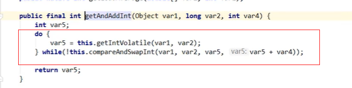

```java
public class SpinLock {
  AtomicReference<Thread> atomicReference = new AtomicReference<>();

  public void Mylock() {
    Thread thread = Thread.currentThread();
    System.out.println(thread.getName() + "=>Mylock");
    System.out.println(thread + "=>Mylock");
    while (!atomicReference.compareAndSet(null, thread)) {
    }
  }

  public void Myunlock() {
    Thread thread = Thread.currentThread();
    System.out.println(thread.getName() + "=>Myumlock");
    atomicReference.compareAndSet(thread, null);
  }
}

class t {
  public static void main(String[] args) {
    SpinLock spinLock = new SpinLock();
    new Thread(() -> {
      spinLock.Mylock();
      try {
        TimeUnit.SECONDS.sleep(5);
      } catch (Exception e) {
        e.printStackTrace();
      } finally {
        spinLock.Myunlock();
      }
    }, "A").start();

    try {
      TimeUnit.SECONDS.sleep(1);
    } catch (InterruptedException e) {
      e.printStackTrace();
    }

    new Thread(() -> {
      spinLock.Mylock();
      try {
        TimeUnit.SECONDS.sleep(1);
      } catch (Exception e) {
        e.printStackTrace();
      } finally {
        spinLock.Myunlock();
      }
    }, "B").start();
  }
}
```

## 死锁

> 排除思路

代码

```java
package com.test.lock8;

import lombok.SneakyThrows;

import java.util.concurrent.TimeUnit;

public class Dome04 {
  public static void main(String[] args) {
    String n = "asd";
    String n2 = "213";
    new Thread(new asd(n, n2), "1").start();
    new Thread(new asd(n2, n), "2").start();
  }
}

class asd implements Runnable {
  private String name;
  private String name1;

  public asd(String name, String name1) {
    this.name = name;
    this.name1 = name1;
  }

  @SneakyThrows
  @Override
  public void run() {
    synchronized (name) {
      TimeUnit.SECONDS.sleep(2);
      synchronized (name1) {
      }
    }
  }
}

```

==jps==

> 默认查看本机jvm进程

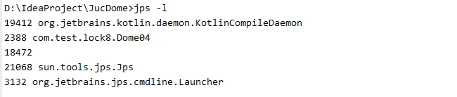

==jstack== 端口名

> 查看该端口堆栈信息

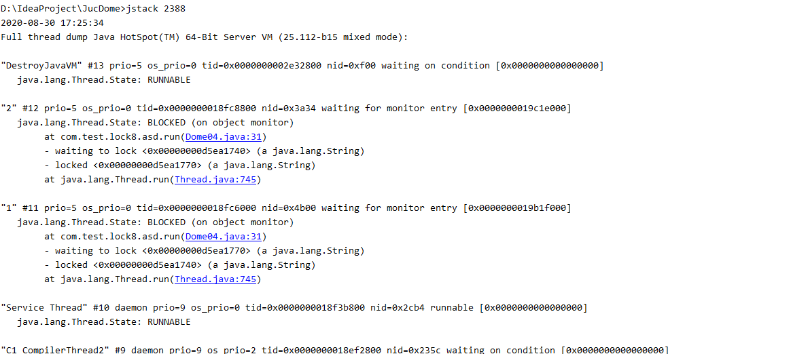