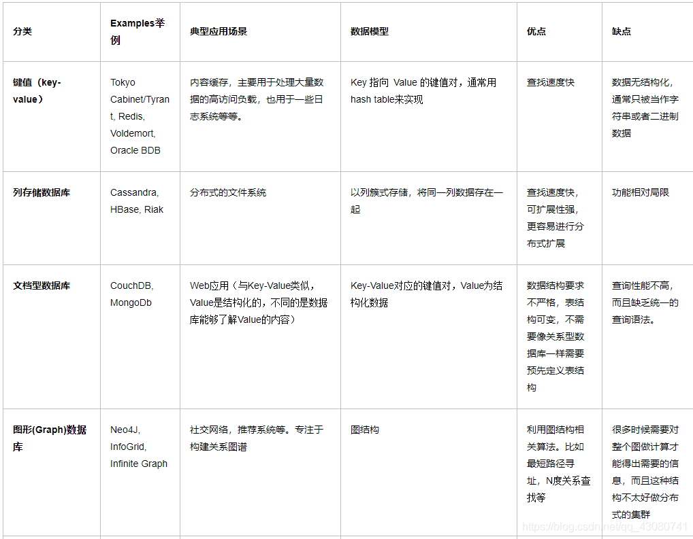
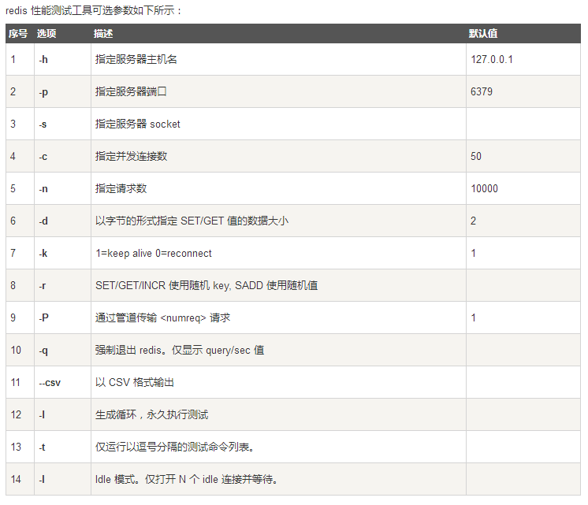
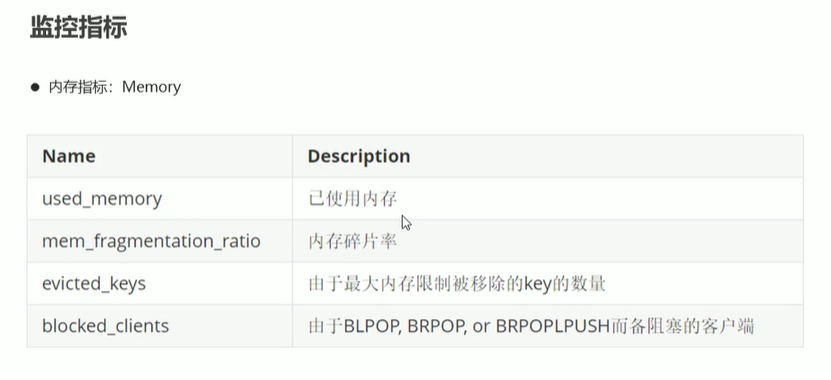

密码 redis123456

# Redis入门

官网地址:https://redis.io/

中文网站:http://redis.cn/

命令查询:http://redis.cn/commands.html

**一般都是在linux上使用,不推荐在window上使用**

## Redis是什么

```
Redis（Remote Dictionary Server )，即远程字典服务
是一个开源的使用ANSI C语言编写、支持网络、可基于内存亦可持久化的日志型
Key-Value数据库，并提供多种语言的API。
redis是非关系型数据库(NoSQL)
为了保证效率，数据都是缓存在内存中。redis会周期性的把更新的数据写入磁盘或者把修改操作写入追加的
记录文件，并且在此基础上实现了master-slave(主从)同步。
Redis支持主从同步。数据可以从主服务器向任意数量的从服务器上同步，从服务器可以是关联其他从服务器
的主服务器。这使得Redis可执行单层树复制。
```

## 性能

下面是官方的bench-mark数据：

测试完成了50个并发执行100000个请求。

设置和获取的值是一个256字节字符串。

Linux box是运行Linux 2.6,这是X3320 Xeon 2.5 ghz。

文本执行使用loopback接口(127.0.0.1)。

结果:读的速度是110000次/s,写的速度是81000次/s 。

## NoSQL数据库的四大分类



# window上下载

地址:https://github.com/tporadowski/redis

下载.zip文件,这是window的压缩文件

解压后为


> 双击打开redis-server.exe文件


> 服务启动后打开redis-cli.exe文件


# linux上下载

> 在window和linux中,这几个基本的启动文件都是一样的

推荐观看博客园https://www.cnblogs.com/zdd-java/p/10288734.html

```shell
ps -ef|grep redis         #查看redi状态
```

## 压力测试




> 使用redis-benchmark进行测试

```shell
./redis-benchmark -n 10000 -c 1000 
```


# 基础知识

> 在安装目录下面redis.conf,是核心配置文件


>
打开redis-cli,进行测试,redis-cli在src目录下面,有些教程会把redis-cli和redis-service创建一个软连接,放在别的地方,或者使用make安装redis,都是一样的,找到这个redis-cli文件执行即可.

```shell
set <key> <value>  #插入数据
get <key>  #查看
keys * #查看所有key
```


```shell
keys * #查看所有key
flushdb 	# 清除当前数据库
flushall    #清除所有数据库
```

# 五大数据类型

## Redis-Key

```bash
set <key> <value>  #插入数据
get <key>  #查看
keys * #查看所有key
exists <key>  #查看当前key是否存在
move <key> 1  #移除当前数据库的key 1表示当前时间
expire <key> <mm>	#mm秒数 表示这个key过多久过期,单位是秒
ttl <key> 	#查看这个key还有多久过期
type <key> 	#查看这个key是什么类型
```

## String

```shell
incr <key>  #执行++操作
decr <key>  #执行--
decrby <key> <length> 	#设置步长,执行一次,加上lenth
incrby <key> <length>	#设置步长,执行一次,减去lenth
---------------------------------------
append <key> <value>	#在key后面增加,没有就新增
strlen <key>   #获取字符串长度
getrange <key> <stat><end> #截取字符串,
setrange <key> <stat> <v> #替换从stat开始的字符串
---------------------------------------
setex <key> <mm> <value> #设置这个keymm秒后过期
setnx <key> <value> #设置key,不存在就创建,存在就失败
ttl <key> #查看这个key还有多久过期
---------------------------------------
mset <key> <value> [k,v] #批量新增key,value
# mset k1 va k2 v2 k3 v3
mget <key> <value> [k,v] #批量新增key,value
# mset k1 k2 k3
msetnx <key> <value> [k,v] #原子性操作,同时成功或者失败,如果某个key有值,则失败

>mset user:1:name zhangsan user:1:age 1
OK
> mget user:1:age user:1:name
1) "1"
2) "zhangsan"
#设置user1的name和age
---------------------------------------
getset <key> <value> #先get值,然后在set  	如果没有值,就会返回null,然后在赋值
```

## List

> redis的list类似于消息队列一样的lputh向左边赋值,放入头部,最后一个赋值的下标为0,
>
> rputh就是右边赋值,给最后一个下标赋值.给尾部赋值
>
> lsit命令大部分都是在前面加个l


```shell
lputh <list> <value>  #list赋值
#向头部赋值
rputh <list> <value>  #list赋值
#向尾部赋值
lrange <list> <stat> <end> #查看值,从stat开始到end的值打印出来
lrange list 0 -1 #查看全部元素
lindex <list> <index> #查看list某个下标的值
llen <list> #查看list的长度
---------------------------------------
#移除
lrem <list> <index> <value> #移除指定的值,index表示几个,可以移除多个value
lpop <list> #移除头部的第一个值
rpop <list> #移除尾部的第一个值
---------------------------------------
ltrim <list><stat><end> 	#通过下标截取list中的元素,从stat开始到end的元素保留,其余的都移除
lset <list> <index> <value>		#更新这个元素,把这个元素的index的值替换为新的值,如果这个下标不存在,则报错
linsert <list> berfore|after <source> <value> 	#在指定位置之前或者之后插入一个值 	beror|after之前或者之后,<source>在哪个元素,<value>新增的内容
---------------------------------------
rpoplpush <resource> <new> 	#rpop移除开始的第一个值,并赋值给new的lpush,就是左边第一个值
```

## set

```shell
sadd <set><value> #创建一个set,赋值value
smembers <set> #查看set的所有值
sismember <set> <value> #set中是否有value这个元素,存在返回1,不存在返回0
scard <set> #set中元素的个数
srem <set> <value>	#移除value	
srandmemver <set> [index]	#随机抽取一个set中的元素
spop <set> #随机移除一个元素  set是不重复的无序的集合
---------------------------------------
smove <source> <new> <value> #把source中的value移动到new中
---------------------------------------
sdiff <source><source1 #查看以source为主的new中不存在的元素,查看差集
sinter <source><source1> #查看交集,这俩个set同时存在的值
sunion <source><source1>	#查看并集,查看俩个set的所有元素
```

## Hash

> 可以看成一个map集合,k:[k:v]

```shell
hset <k> <k1> <value>[k2 value...]	#赋值,也可以赋值多个
hget <k> <k1> #取值
hmset <k> <k1> <value>[k2 value...]  #同时set多个值
hmget <k> <k1> [k2 ...] #同时取多个值
hgetall <k>	#查看k中所有元素
hdel <k> <k1>[k2 k3...]	#删除k中指定的元素
hlen <k> #获取hash的元素个数
---------------------------------------
hexists <k> <k1> #判断k1是否存在
hkeys <k> #查看所有的k1
hvals <k> #只获取所有的value
---------------------------------------
hincrby <k> <k1> <sum> #给这个减去sum
hdecrby <k> <k1> <sum> #给这个减去sum
hsetnx <k> <k1> <value> #设置key,不存在就创建,存在就失败
---------------------------------------

```

## Zset

```shell
zadd <zset> <key> <value>[ <index> <value>] #添加Zset集合,key可以用来排序
zrange <zset> <stat><end> #和上面一样,查询,end为-0是查全部
---------------------------------------
zrangebyscore <zset> <key> <max> [withscores]#排序,min最小值-inf,max最大值可以用+inf,withscores这个是加上key这个参数排序,不写则只显示value
zrangebyscore zsetname -inf +inf withscores #会把zsetname的值从小到大排序,加上withscores就会把key的值也显示在下面,不加则不显示.+inf也可以写成250,则显示index最大值为250的值,-inf同理
zrevrange <zset><stat><end>#zrevrange zsetname 0 -1从高到底排序
---------------------------------------
zrem <zset><value>[value...]#移除指定的元素,可以多个
zcard <zset> #查看有几个元素
zcont <zset> <stat><end>#查询从stat到end之间有几个元素
```

# 三种特殊数据类型

## geospatial

> GEOADD

```shell
GEOADD <key> <经度><维度> <value>[<经度><维度> <value>]	#添加一个坐标,value是名字

#EOADD china 13.361389 38.115556 "shanghai" 15.087269 37.502669 "beijing"
```

> GEODIST

```shell
GEODIST <key><value> [value] <unit> #获取俩个地理位置的距离
#	unit代表返回结果的单位，包含以下四种：
#	m（meters）代表米
#	km（kilometers）代表公里
#	mi（miles）代表英里
#	ft（feet）代表尺

#geodist china beijing tianjin km
```

> Geohash

```shell
GEOHASH <key> <value> [value ...] #将二维的经纬度转换成字符串
```

> GEOPOS

```shell
GEOPOS key member [member ...] #从key里返回所有给定位置元素的位置（经度和纬度）。

#GEOPOS Sicily Palermo Catania NonExisting
```

> GEORADIUS

```shell
GEORADIUS key longitude latitude radius m|km|ft|mi [WITHCOORD] [WITHDIST] [WITHHASH] [COUNT count]
#以给定的经纬度为中心， 返回键包含的位置元素当中， 与中心的距离不超过给定最大距离的所有位置元素。范围可以使用以下其中一个单位：
m 表示单位为米。
km 表示单位为千米。
mi 表示单位为英里。
ft 表示单位为英尺。
#在给定以下可选项时， 命令会返回额外的信息：
WITHDIST: 在返回位置元素的同时， 将位置元素与中心之间的距离也一并返回。 距离的单位和用户给定的范围单位保持一致。
WITHCOORD: 将位置元素的经度和维度也一并返回。
WITHHASH: 以 52 位有符号整数的形式， 返回位置元素经过原始 geohash 编码的有序集合分值。 这个选项主要用于底层应用或者调试， 实际中的作用并不大。
#命令默认返回未排序的位置元素。 通过以下两个参数， 用户可以指定被返回位置元素的排序方式：
ASC: 根据中心的位置， 按照从近到远的方式返回位置元素。
DESC: 根据中心的位置， 按照从远到近的方式返回位置元素。

在默认情况下， GEORADIUS 命令会返回所有匹配的位置元素。 虽然用户可以使用 COUNT <count> 选项去获取前 N 个匹配元素， 但是因为命令在内部可能会需要对所有被匹配的元素进行处理， 所以在对一个非常大的区域进行搜索时， 即使只使用 COUNT 选项去获取少量元素， 命令的执行速度也可能会非常慢。 但是从另一方面来说， 使用 COUNT 选项去减少需要返回的元素数量， 对于减少带宽来说仍然是非常有用的。

```

## hyperloglog

> 可以用来做统计,hyperloglog可以看成一个不重复,无序set集合.可以用来做统计
>
> hyperloglog有大约0.81%的误差,如果不希望有误差,就不要使用hyperloglog

```shell
PFADD key element [element ...] #类似于一个set集合,放多个element
PFCOUNT key [key ...] #统计key有多少个元素,返回的可见集合基数并不是精确值， 而是一个带有 0.81% 标准错误
PFMERGE destkey sourcekey [sourcekey ...] #将多个sourcekey合并为一个destkey
```

## bitmap

```shell
SETBIT key offset value #设置一个key的offset的状态,这个由value（只能是0或者1）来决定。
getbit key offset #查看key的offset的value
BITCOUNT key [start end] #查看key中value为1的值有多少,start和end是开始和结束,对应offset
```

# Redis事务

- 事务是一个单独的隔离操作：事务中的所有命令都会序列化、按顺序地执行。事务在执行的过程中，不会被其他客户端发送来的命令请求所打断。
- 事务是一个原子操作：事务中的命令要么全部被执行，要么全部都不执行。
- 另一方面，如果客户端成功在开启事务之后执行 [EXEC](http://redis.cn/commands/exec.html) ，那么事务中的所有命令都会被执行。
- 最重要的是记住这样一条， 即使事务中有某条/某些命令执行失败了， 事务队列中的其他命令仍然会继续执行 —— Redis 不会停止执行事务中的命令。

```shell
MULTI #标记一个事务块的开始。 随后的指令将在执行EXEC时作为一个原子执行。

EXEC  #执行事务中所有在排队等待的指令并将链接状态恢复到正常 当使用WATCH 时，只有当被监视的键没有被修改，且允许检查设定机制时，EXEC会被执行

DISCARD #把MULTI后的命令全部丢弃,当执行 DISCARD 命令时， 事务会被放弃， 事务队列会被清空， 并且客户端会从事务状态中退出：

WATCH key [key ...] #标记所有指定的key 被监视起来，在事务中有条件的执行（乐观锁）。被 WATCH 的键会被监视，并会发觉这些键是否被改动过了。 如果有至少一个被监视的键在 EXEC 执行之前被修改了， 那么整个事务都会被取消， EXEC 返回nil-reply来表示事务已经失败。

UNWATCH #取消事务,刷新一个事务中已被监视的所有key。
```

# mysql悲观锁和乐观锁

## 乐观锁

在表格中加上一个version字段,每次查询的时候查询这个version.在每次修改的时候判断这个version是否相等,只有相等才修改,不相等就说明已经修改过这个字段了

## 悲观锁

一般使用for update

* 仅适用于InnoDB
* for update是行锁或者表锁,行锁必须指定主键
* 只有当出现如下之一的条件，才会释放共享更新锁
    * 执行提交（COMMIT）语句
    * 退出数据库（LOG OFF）
    * 程序停止运行
* 且必须在事务处理模块(BEGIN/COMMIT)中才能生效。必须在事务中执行

```sql
--每次要修改的时候,要知道这条修改数据的主键,然后加上锁
SELECT *
FROM user
WHERE id = 3 FOR UPDATE
--这里是把user中的主键id为3的这一行锁住,在并发情况下只有在这个客户端中把for update释放了,
-- 其余地方才能够修改这行.不然其余线程必须等待这个for update释放.如果没有指定主键,则会把表锁了
update user
set name=name
where id = 3
--必须在事务中,不然一直都不会释放
```

# jedis

> jedis是java连接Redis的工具

## 使用

> 导入jar包

```xml

<dependency>
    <groupId>redis.clients</groupId>
    <artifactId>jedis</artifactId>
    <version>3.3.0</version>
</dependency>
```

> 打开本地的redis服务


> 在@Test中测试

```java
@Test
public void t1(){
        Jedis jedis=new Jedis("127.0.0.1",6379);//连接Redis
        System.out.println(jedis.ping());//测试连接
        jedis.set("key","张三");    //set赋值key的value为张三
        System.out.println(jedis.get("key"));    //获取key
        jedis.close();//关闭连接
        }
//测试结果和上面一样,PONG 	张三

```

> 打开Jedis的底层


> 上面的五大数据类型和三种特殊数据的用法都已经很清楚了,上面的每个命令对应的是java的一个方法,这样理解就会很容易上手

如果是连接的远程,阿里云的就要开启安全组的端口,不然会连接不上

## 事务

```java
public class test {
  @Test
  public void t2() {
    Jedis jedis = new Jedis("127.0.0.1", 6379);
    jedis.flushDB();
    //jedis.watch("key");//类似加上乐观锁
    Transaction multi = jedis.multi();//开启redis的事务
    try {
      multi.set("key", "张三");//set值
      multi.set("key1", "张四");
      multi.exec();
      System.out.println(jedis.get("key"));
      System.out.println(jedis.get("key1"));
    } catch (Exception e) {
      multi.discard();//取消事务
      e.printStackTrace();
    } finally {
      //jedis.unwatch();//取消事务,刷新一个事务中已被监视的所有key。
      jedis.close();//关闭连接
    }
  }
}
//结果张三张四
```

# springboot集成Redis

> 在springboot2.x之后,原来的jedis被替换成了lettuce

jedis: 采用的是直连,多个线程不安全的,更像Bio模式

lettuce:采用的是netty,实例可以在多个线程中共享,可以减少线程数量,更像Nio模式

> 前面提到过springboot的源码分析,redis也有自动配置文件,找到spring.factories里面的RedisAutoConfiguration


## 用法

> 导入maven,这里是springboot项目

```xml

<dependency>
    <groupId>org.springframework.boot</groupId>
    <artifactId>spring-boot-starter-data-redis</artifactId>
</dependency>
```

> 配置

```yaml
spring:
  redis:
    host: 127.0.0.1
    port: 6379
```

> 这里自己配置了默认的,也可以不用配置,但是如果连接远程就需要配置


```java
//在SpringBootTest后面加上	(webEnvironment = SpringBootTest.WebEnvironment.RANDOM_PORT)
@SpringBootTest(webEnvironment = SpringBootTest.WebEnvironment.RANDOM_PORT)
class DemoApplicationTests {

    @Autowired
    private RedisTemplate redisTemplate;

    @Test
    void contextLoads() {
//  获取redis的连接对象
//RedisConnection connection = redisTemplate.getConnectionFactory().getConnection();
//        connection.flushDb();
      //redisTemplate.opsForGeo()  Geo地址
      // redisTemplate.opsForHash()  hash类型
      //redisTemplate.opsForSet()     Set类型等等
      redisTemplate.opsForValue().set("key", "张三");
      System.out.println(redisTemplate.opsForValue().get("key"));
      //redisTemplate还提供了几种常用的方法,如事务,类型等等
      //redisTemplate.multi();
      //redisTemplate.exec() 
      //redisTemplate.watch();
      // redisTemplate.type()
    }

}
```

> 在客户端使用中文字会乱码,而在java不会乱码,是因为redistemplate使用了序列化


# 配置Redis

> redis配置

```java
package com.sboot.config;

@Configuration
public class RedisConfig {

    @Bean(name = "strRedisTemplate")
    public RedisTemplate<String, Object> strRedisTemplate(RedisConnectionFactory redisConnectionFactory) {
        RedisTemplate<String, Object> redisTemplate = new RedisTemplate<>();
        redisTemplate.setConnectionFactory(redisConnectionFactory);
        //json的序列化
        Jackson2JsonRedisSerializer<Object> jackson2JsonRedisSerializer = new Jackson2JsonRedisSerializer<Object>(Object.class);
        ObjectMapper objectMapper = new ObjectMapper();
        objectMapper.setVisibility(PropertyAccessor.ALL, JsonAutoDetect.Visibility.ANY);
        objectMapper.enableDefaultTyping(ObjectMapper.DefaultTyping.NON_FINAL);
        jackson2JsonRedisSerializer.setObjectMapper(objectMapper);
        //String方式序列化
        StringRedisSerializer stringRedisSerializer = new StringRedisSerializer();
        //key使用String的序列化就好了
        redisTemplate.setKeySerializer(stringRedisSerializer);
        //hash的key也是用string的序列化
        redisTemplate.setHashKeySerializer(stringRedisSerializer);
        //string也使用string的序列化
        redisTemplate.setStringSerializer(stringRedisSerializer);
        //Value使用json序列化
        redisTemplate.setValueSerializer(jackson2JsonRedisSerializer);
        //hash的value使用json序列化
        redisTemplate.setHashValueSerializer(jackson2JsonRedisSerializer);

        redisTemplate.afterPropertiesSet();
        return redisTemplate;
    }
}
```

> redis工具类

```java
package com.sboot.utils;

import org.springframework.beans.factory.annotation.Autowired;
import org.springframework.beans.factory.annotation.Qualifier;
import org.springframework.data.redis.core.RedisTemplate;
import org.springframework.stereotype.Component;
import org.springframework.util.CollectionUtils;

import java.util.List;
import java.util.Map;
import java.util.Set;
import java.util.concurrent.TimeUnit;

/**
 * redis常用方法
 *
 * @author 一个小小卒
 */
@Component
public class RedisUtil {

    @Autowired
    @Qualifier("strRedisTemplate")
    private RedisTemplate<String, Object> redisTemplate;

    /**
     * 指定key失效时间
     *
     * @param key  键
     * @param time 时间(秒)
     * @return
     */
    public boolean setTime(String key, long time) {
        try {
            if (time > 0) {
                redisTemplate.expire(key, time, TimeUnit.SECONDS);
            }
            return true;
        } catch (Exception e) {
            e.printStackTrace();
            return false;
        }
    }

    /**
     * 根据key 获取过期时间
     *
     * @param key 不能为null
     * @return 时间(秒) 返回0代表为永久有效
     */
    public long getTime(String key) {
        return redisTemplate.getExpire(key, TimeUnit.SECONDS);
    }

    /**
     * 判断key是否存在
     *
     * @param key 键
     * @return true 存在 false不存在
     */
    public boolean hasKey(String key) {
        try {
            return redisTemplate.hasKey(key);
        } catch (Exception e) {
            e.printStackTrace();
            return false;
        }
    }

    /**
     * 删除key
     *
     * @param key 可以传一个值 或多个
     */
    @SuppressWarnings("unchecked")
    public void del(String... key) {
        if (key != null && key.length > 0) {
            if (key.length == 1) {
                redisTemplate.delete(key[0]);
            } else {
                redisTemplate.delete(CollectionUtils.arrayToList(key));
            }
        }
    }


    /**
     * 获取key
     *
     * @param key 键
     * @return 值
     */
    public Object get(String key) {
        return key == null ? null : redisTemplate.opsForValue().get(key);
    }

    /**
     * string放入
     *
     * @param key   键
     * @param value 值
     * @return true成功 false失败
     */
    public boolean set(String key, Object value) {
        try {
            redisTemplate.opsForValue().set(key, value);
            return true;
        } catch (Exception e) {
            e.printStackTrace();
            return false;
        }
    }

    /**
     * string放入并设置时间
     *
     * @param key   键
     * @param value 值
     * @param time  时间(秒) time要大于0 如果time小于等于0 将设置无限期
     * @return true成功 false 失败
     */
    public boolean set(String key, Object value, long time) {
        try {
            if (time > 0) {
                redisTemplate.opsForValue().set(key, value, time, TimeUnit.SECONDS);
            } else {
                set(key, value);
            }
            return true;
        } catch (Exception e) {
            e.printStackTrace();
            return false;
        }
    }

    /**
     * key递增
     *
     * @param key   键
     * @param delta 要增加几(大于0)
     * @return
     */
    public long incr(String key, long delta) {
        if (delta < 0) {
            throw new RuntimeException("递增因子必须大于0");
        }
        return redisTemplate.opsForValue().increment(key, delta);
    }

    /**
     * key递减
     *
     * @param key   键
     * @param delta 要减少几(小于0)
     * @return
     */
    public long decr(String key, long delta) {
        if (delta < 0) {
            throw new RuntimeException("递减因子必须大于0");
        }
        return redisTemplate.opsForValue().increment(key, -delta);
    }

    // ================================Map=================================

    /**
     * map
     *
     * @param key  键 不能为null
     * @param item 不能为null
     * @return 值
     */
    public Object getMap(String key, String item) {
        return redisTemplate.opsForHash().get(key, item);
    }

    /**
     * 获取hashKey对应的所有键值
     *
     * @param key 键
     * @return 对应的多个键值
     */
    public Map<Object, Object> getMapKey(String key) {
        return redisTemplate.opsForHash().entries(key);
    }

    /**
     * 放入map
     *
     * @param key 键
     * @param map 对应多个键值
     * @return true 成功 false 失败
     */
    public boolean setMap(String key, Map<String, Object> map) {
        try {
            redisTemplate.opsForHash().putAll(key, map);
            return true;
        } catch (Exception e) {
            e.printStackTrace();
            return false;
        }
    }

    /**
     * map 并设置时间
     *
     * @param key  键
     * @param map  对应多个键值
     * @param time 时间(秒) time要大于0 如果time小于等于0 将设置无限期
     * @return true成功 false失败
     */
    public boolean setMapTime(String key, Map<String, Object> map, long time) {
        try {
            redisTemplate.opsForHash().putAll(key, map);
            if (time > 0) {
                setTime(key, time);
            }
            return true;
        } catch (Exception e) {
            e.printStackTrace();
            return false;
        }
    }


    /**
     * 删除map表中的值
     *
     * @param key  键 不能为null
     * @param item 项 可以使多个 不能为null
     */
    public void delMap(String key, Object... item) {
        redisTemplate.opsForHash().delete(key, item);
    }

    /**
     * 判断Map表中是否有该项的值
     *
     * @param key  键 不能为null
     * @param item 项 不能为null
     * @return true 存在 false不存在
     */
    public boolean ifMap(String key, String item) {
        return redisTemplate.opsForHash().hasKey(key, item);
    }

    /**
     * Map递增 如果不存在,就会创建一个 并把新增后的值返回
     *
     * @param key  键
     * @param item 项
     * @param by   要增加几(大于0)
     * @return
     */
    public double mapIncr(String key, String item, double by) {
        return redisTemplate.opsForHash().increment(key, item, by);
    }

    /**
     * map递减
     *
     * @param key  键
     * @param item 项
     * @param by   要减少几(小于0)
     * @return
     */
    public double mapDecr(String key, String item, double by) {
        return redisTemplate.opsForHash().increment(key, item, -by);

    }

    // ============================Zset=============================

    /**
     * 根据key获取ZSet中的所有值
     *
     * @param key 键
     * @return
     */
    public Set<Object> getZset(String key) {
        try {
            return redisTemplate.opsForSet().members(key);
        } catch (Exception e) {
            e.printStackTrace();
            return null;
        }
    }

    /**
     * 根据value从一个Zset中查询,是否存在
     *
     * @param key   键
     * @param value 值
     * @return true 存在 false不存在
     */

    public boolean ifZset(String key, Object value) {
        try {
            return redisTemplate.opsForSet().isMember(key, value);
        } catch (Exception e) {
            e.printStackTrace();
            return false;
        }
    }

    /**
     * 将数据放入zset
     *
     * @param key    键
     * @param values 值 可以是多个
     * @return 成功个数
     */
    public long setZset(String key, Object... values) {
        try {
            return redisTemplate.opsForSet().add(key, values);
        } catch (Exception e) {
            e.printStackTrace();
            return 0;
        }
    }

    /**
     * 将zset数据放入,并设置过期时间
     *
     * @param key    键
     * @param time   时间(秒)
     * @param values 值 可以是多个
     * @return 成功个数
     */
    public long setZsetTime(String key, long time, Object... values) {
        try {
            Long count = redisTemplate.opsForSet().add(key, values);
            if (time > 0)
                setTime(key, time);
            return count;
        } catch (Exception e) {
            e.printStackTrace();
            return 0;
        }
    }

    /**
     * 获取set缓存的长度
     *
     * @param key 键
     * @return 358
     */
    public long getZsetlength(String key) {
        try {
            return redisTemplate.opsForSet().size(key);
        } catch (Exception e) {
            e.printStackTrace();
            return 0;
        }
    }

    /**
     * 移除值为value的zset
     *
     * @param key    键
     * @param values 值 可以是多个
     * @return 移除的个数
     */
    public long remZset(String key, Object... values) {
        try {
            Long count = redisTemplate.opsForSet().remove(key, values);
            return count;
        } catch (Exception e) {
            e.printStackTrace();
            return 0;
        }
    }

    // ===============================list=================================

    /**
     * 获取list指定下标内容内容
     *
     * @param key   键
     * @param start 开始
     * @param end   结束 0 到 -1代表所有值
     * @return 391
     */
    public List<Object> getList(String key, long start, long end) {
        try {
            return redisTemplate.opsForList().range(key, start, end);
        } catch (Exception e) {
            e.printStackTrace();
            return null;
        }
    }

    /**
     * 获取list缓存的长度
     *
     * @param key 键
     * @return 405
     */
    public long getListLenth(String key) {
        try {
            return redisTemplate.opsForList().size(key);
        } catch (Exception e) {
            e.printStackTrace();
            return 0;
        }
    }

    /**
     * 通过索引 获取list中的值
     *
     * @param key   键
     * @param index 索引 index>=0时， 0 表头，1 第二个元素，依次类推；index<0时，-1，表尾，-2倒数第二个元素，依次类推
     * @return 420
     */
    public Object getListIndex(String key, long index) {
        try {
            return redisTemplate.opsForList().index(key, index);
        } catch (Exception e) {
            e.printStackTrace();
            return null;
        }
    }

    /**
     * 将list放入
     *
     * @param key   键
     * @param value 值
     */
    public boolean setList(String key, Object value) {
        try {
            redisTemplate.opsForList().rightPush(key, value);
            return true;
        } catch (Exception e) {
            e.printStackTrace();
            return false;
        }
    }

    /**
     * 将list放入缓存并添加过期时间
     *
     * @param key   键
     * @param value 值
     * @param time  时间(秒)
     * @return
     */
    public boolean setListTime(String key, Object value, long time) {
        try {
            redisTemplate.opsForList().rightPush(key, value);
            if (time > 0)
                setTime(key, time);
            return true;
        } catch (Exception e) {
            e.printStackTrace();
            return false;
        }
    }

    /**
     * 将list放入缓存
     *
     * @param key   键
     * @param value 值
     * @return
     */
    public boolean setList(String key, List<Object> value) {
        try {
            redisTemplate.opsForList().rightPushAll(key, value);
            return true;
        } catch (Exception e) {
            e.printStackTrace();
            return false;
        }
    }

    /**
     * 将list放入缓存,并添加过期时间
     *
     * @param key   键
     * @param value 值
     * @param time  时间(秒)
     * @return
     */
    public boolean setListTime(String key, List<Object> value, long time) {
        try {
            redisTemplate.opsForList().rightPushAll(key, value);
            if (time > 0)
                setTime(key, time);
            return true;
        } catch (Exception e) {
            e.printStackTrace();
            return false;
        }
    }

    /**
     * 根据索引修改list中的某条数据
     *
     * @param key   键
     * @param index 索引
     * @param value 修改的值
     * @return 509
     */
    public boolean updateList(String key, long index, Object value) {
        try {
            redisTemplate.opsForList().set(key, index, value);
            return true;
        } catch (Exception e) {
            e.printStackTrace();
            return false;
        }
    }

    /**
     * 移除N个值为value
     *
     * @param key   键
     * @param count 移除多少个
     * @param value 值
     * @return 移除的个数
     */
    public long remList(String key, long count, Object value) {
        try {
            Long remove = redisTemplate.opsForList().remove(key, count, value);
            return remove;
        } catch (Exception e) {
            e.printStackTrace();
            return 0;
        }
    }
}

```

> 这些配置都可以不要,只不过为了方便,所以写个配置在使用的时候会方便很多

# Redis-config

> 找到redis-config文件,打开


 ```shell
#redis3.2版本后新增protected-mode配置，默认是yes，即开启。设置外部网络连接redis服务，设置方式如下：
#1、关闭protected-mode模式，此时外部网络可以直接访问
#2、开启protected-mode保护模式，需配置bind ip或者设置访问密码
protected-mode yes #保护模式
port 6379 #端口号
daemonize yes #开启线程守护,默认是关闭的
pidfile /www/server/redis/redis.pid #以后台方式运行,就需要指定一个pid

# Specify the server verbosity level.
# This can be one of:
# debug (a lot of information, useful for development/testing)
# verbose (many rarely useful info, but not a mess like the debug level)
# notice (moderately verbose, what you want in production probably)
# warning (only very important / critical messages are logged)
loglevel notice	#日志级别.有上面几种类型,
logfile "/www/server/redis/redis.log"#配置日志的位置	
databases 16 #默认16个数据库
always-show-logo yes#是否开启log
 ```

> SNAPSHOTTING 快照

持久化,在规定时间内,执行了多少次,就会持久化到文件,有.rdb文件和.aof文件

```shell
save 900 1 #在900秒内,修改了1个key.就会进行持久化
save 300 10#在300秒内,修改了10个key.就会进行持久化
save 60 10000#在900秒内,修改了1个key.就会进行持久化
stop-writes-on-bgsave-error yes #持久化出错了是否继续工作
rdbcompression yes #是否压缩rdb文件
rdbchecksum yes #保存rdb文件校验
dbfilename dump.rdb #rdb文件名字
dir /www/server/redis/ #文件保存地址
```

> REPLICATION 主从赋值


> SECURITY 安全

```shell
requirepass foobared  #在redis中默认是没有密码的,所以这个一开始是注释掉的,可以在下面自己写 也可以在客户端redis-cli中设置
127.0.0.1:6379> config get requirepass  #查看redis的密码
1) "requirepass"
2) ""
127.0.0.1:6379> config set requirepass 123456 #给redis设置密码
OK
127.0.0.1:6379> exit 
127.0.0.1:6379> config get requirepass  #退出后查看redis就没有权限了
(error) NOAUTH Authentication required.
127.0.0.1:6379> auth 123456 #使用密码登录
OK
127.0.0.1:6379> config get requirepass  #登录后
1) "requirepass"
2) "123456"

```

> CLIENTS限制

```shell
# maxclients 10000 #设置最大客户端数量
```

> MEMORY MANAGEMENT

```shell
# maxmemory <bytes> #配置redis的最大容量
# maxmemory-policy noeviction  #内存达到最大值后处理策略
1、volatile-lru：只对设置了过期时间的key进行LRU（默认值） 
2、allkeys-lru ： 删除lru算法的key   
3、volatile-random：随机删除即将过期key   
4、allkeys-random：随机删除   
5、volatile-ttl ： 删除即将过期的   
6、noeviction ： 永不过期，返回错误
```

> APPEND ONLY MODE aof的配置

```shell
appendonly no #默认不开启aof,一般使用rdb
appendfilename "appendonly.aof"  #持久化名字

# appendfsync always #每次修改就会同步
appendfsync everysec #每秒同步一次
# appendfsync no #不同步,系统自己同步
```

# Redis持久化

## 内存持久化

## RDB


## AOF


### 重写


## 区别


# Reids配置优化

## JRedis序列化

```java

@Configuration
public class RedisConfig {
  @Bean(name = "strRedisTemplate")
  public RedisTemplate<String, Object> strRedisTemplate(
          RedisConnectionFactory redisConnectionFactory) {
    RedisTemplate<String, Object> redisTemplate = new RedisTemplate<>();
    redisTemplate.setConnectionFactory(redisConnectionFactory);
    // json的序列化
    Jackson2JsonRedisSerializer<Object> jackson2JsonRedisSerializer =
            new Jackson2JsonRedisSerializer<Object>(Object.class);
    ObjectMapper objectMapper = new ObjectMapper();
    objectMapper.setVisibility(PropertyAccessor.ALL, JsonAutoDetect.Visibility.ANY);
    objectMapper.enableDefaultTyping(ObjectMapper.DefaultTyping.NON_FINAL);
    jackson2JsonRedisSerializer.setObjectMapper(objectMapper);
    // String方式序列化
    StringRedisSerializer stringRedisSerializer = new StringRedisSerializer();
    // key使用String的序列化就好了
    redisTemplate.setKeySerializer(stringRedisSerializer);
    // hash的key也是用string的序列化
    redisTemplate.setHashKeySerializer(stringRedisSerializer);
    // string也使用string的序列化
    redisTemplate.setStringSerializer(stringRedisSerializer);
    // Value使用json序列化
    redisTemplate.setValueSerializer(jackson2JsonRedisSerializer);
    // hash的value使用json序列化
    redisTemplate.setHashValueSerializer(jackson2JsonRedisSerializer);

    redisTemplate.afterPropertiesSet();
    return redisTemplate;
  }
}
```

## JRedis常用方法

```java

@Component
public class RedisUtil {

  @Autowired
  @Qualifier("strRedisTemplate")
  private RedisTemplate<String, Object> redisTemplate;

  /**
   * 指定key失效时间
   *
   * @param key 键
   * @param time 时间(秒)
   * @return
   */
  public boolean setTime(String key, long time) {
    try {
      if (time > 0) {
        redisTemplate.expire(key, time, TimeUnit.SECONDS);
      }
      return true;
    } catch (Exception e) {
      e.printStackTrace();
      return false;
    }
  }

  /**
   * 根据key 获取过期时间
   *
   * @param key 不能为null
   * @return 时间(毫秒) 返回0代表为永久有效
   */
  public long getTime(String key) {
    return redisTemplate.getExpire(key, TimeUnit.MILLISECONDS);
  }

  /**
   * 使用bitmap赋值
   *
   * @param key
   * @param offset
   * @param value
   * @return
   */
  public Boolean setBit(String key, long offset, boolean value) {
    return redisTemplate.opsForValue().setBit(key, offset, value);
  }

  /**
   * 判断是否标记过
   *
   * @param key
   * @param offset
   * @return
   */
  public Boolean ifBit(String key, long offset) {
    return redisTemplate.opsForValue().getBit(key, offset);
  }

  /**
   * 统计计数,有多少个offset
   *
   * @param key
   * @return
   */
  public long bitCount(String key) {
    return redisTemplate.execute(
            new RedisCallback<Long>() {
              @Override
              public Long doInRedis(RedisConnection redisConnection) throws DataAccessException {
                return redisConnection.bitCount(key.getBytes());
              }
            });
  }

  /**
   * 判断key是否存在
   *
   * @param key 键
   * @return true 存在 false不存在
   */
  public boolean hasKey(String key) {
    try {
      return redisTemplate.hasKey(key);
    } catch (Exception e) {
      e.printStackTrace();
      return false;
    }
  }

  /**
   * 删除key
   *
   * @param key 可以传一个值 或多个
   */
  @SuppressWarnings("unchecked")
  public void del(String... key) {
    if (key != null && key.length > 0) {
      if (key.length == 1) {
        redisTemplate.delete(key[0]);
      } else {
        redisTemplate.delete(CollectionUtils.arrayToList(key));
      }
    }
  }

  /**
   * 获取key
   *
   * @param key 键
   * @return 值
   */
  public Object get(String key) {
    return key == null ? null : redisTemplate.opsForValue().get(key);
  }

  /**
   * string放入
   *
   * @param key 键
   * @param value 值
   * @return true成功 false失败
   */
  public boolean set(String key, Object value) {
    try {
      redisTemplate.opsForValue().set(key, value);
      return true;
    } catch (Exception e) {
      e.printStackTrace();
      return false;
    }
  }

  /**
   * string放入并设置过期时间
   *
   * @param key 键
   * @param value 值
   * @param time 时间
   * @return
   */
  public boolean set(String key, Object value, long time) {
    try {
      if (time > 0) {
        redisTemplate.opsForValue().set(key, value, time, TimeUnit.MILLISECONDS);
      } else {
        set(key, value);
      }
      return true;
    } catch (Exception e) {
      e.printStackTrace();
      return false;
    }
  }

  /**
   * key递增
   *
   * @param key 键
   * @param delta 要增加几(大于0)
   * @return
   */
  public long incr(String key, long delta) {
    if (delta < 0) {
      throw new RuntimeException("递增因子必须大于0");
    }
    return redisTemplate.opsForValue().increment(key, delta);
  }

  /**
   * key递减
   *
   * @param key 键
   * @param delta 要减少几(小于0)
   * @return
   */
  public long decr(String key, long delta) {
    if (delta < 0) {
      throw new RuntimeException("递减因子必须大于0");
    }
    return redisTemplate.opsForValue().increment(key, -delta);
  }

  // ================================Map=================================

  /**
   * map
   *
   * @param key 键 不能为null
   * @param item 不能为null
   * @return 值
   */
  public Object getMap(String key, String item) {
    return redisTemplate.opsForHash().get(key, item);
  }

  /**
   * 获取hashKey对应的所有键值
   *
   * @param key 键
   * @return 对应的多个键值
   */
  public Map<Object, Object> getMapKey(String key) {
    return redisTemplate.opsForHash().entries(key);
  }

  /**
   * 放入map
   *
   * @param key 键
   * @param map 对应多个键值
   * @return true 成功 false 失败
   */
  public boolean setMap(String key, Map<String, Object> map) {
    try {
      redisTemplate.opsForHash().putAll(key, map);
      return true;
    } catch (Exception e) {
      e.printStackTrace();
      return false;
    }
  }

  /**
   * map 并设置时间
   *
   * @param key 键
   * @param map 对应多个键值
   * @param time 时间(秒) time要大于0 如果time小于等于0 将设置无限期
   * @return true成功 false失败
   */
  public boolean setMapTime(String key, Map<String, Object> map, long time) {
    try {
      redisTemplate.opsForHash().putAll(key, map);
      if (time > 0) {
        setTime(key, time);
      }
      return true;
    } catch (Exception e) {
      e.printStackTrace();
      return false;
    }
  }

  /**
   * 删除map表中的值
   *
   * @param key 键 不能为null
   * @param item 项 可以使多个 不能为null
   */
  public void delMap(String key, Object... item) {
    redisTemplate.opsForHash().delete(key, item);
  }

  /**
   * 判断Map表中是否有该项的值
   *
   * @param key 键 不能为null
   * @param item 项 不能为null
   * @return true 存在 false不存在
   */
  public boolean ifMap(String key, String item) {
    return redisTemplate.opsForHash().hasKey(key, item);
  }

  /**
   * Map递增 如果不存在,就会创建一个 并把新增后的值返回
   *
   * @param key 键
   * @param item 项
   * @param by 要增加几(大于0)
   * @return
   */
  public double mapIncr(String key, String item, double by) {
    return redisTemplate.opsForHash().increment(key, item, by);
  }

  /**
   * map递减
   *
   * @param key 键
   * @param item 项
   * @param by 要减少几(小于0)
   * @return
   */
  public double mapDecr(String key, String item, double by) {
    return redisTemplate.opsForHash().increment(key, item, -by);
  }

  // ============================Zset=============================

  /**
   * 根据key获取ZSet中的所有值
   *
   * @param key 键
   * @return
   */
  public Set<Object> getZset(String key) {
    try {
      return redisTemplate.opsForSet().members(key);
    } catch (Exception e) {
      e.printStackTrace();
      return null;
    }
  }

  /**
   * 根据value从一个Zset中查询,是否存在
   *
   * @param key 键
   * @param value 值
   * @return true 存在 false不存在
   */
  public boolean ifZset(String key, Object value) {
    try {
      return redisTemplate.opsForSet().isMember(key, value);
    } catch (Exception e) {
      e.printStackTrace();
      return false;
    }
  }

  /**
   * 将数据放入zset
   *
   * @param key 键
   * @param values 值 可以是多个
   * @return 成功个数
   */
  public long setZset(String key, Object... values) {
    try {
      return redisTemplate.opsForSet().add(key, values);
    } catch (Exception e) {
      e.printStackTrace();
      return 0;
    }
  }

  /**
   * 将zset数据放入,并设置过期时间
   *
   * @param key 键
   * @param time 时间(秒)
   * @param values 值 可以是多个
   * @return 成功个数
   */
  public long setZsetTime(String key, long time, Object... values) {
    try {
      Long count = redisTemplate.opsForSet().add(key, values);
      if (time > 0) setTime(key, time);
      return count;
    } catch (Exception e) {
      e.printStackTrace();
      return 0;
    }
  }

  /**
   * 获取set缓存的长度
   *
   * @param key 键
   * @return 358
   */
  public long getZsetlength(String key) {
    try {
      return redisTemplate.opsForSet().size(key);
    } catch (Exception e) {
      e.printStackTrace();
      return 0;
    }
  }

  /**
   * 移除值为value的zset
   *
   * @param key 键
   * @param values 值 可以是多个
   * @return 移除的个数
   */
  public long remZset(String key, Object... values) {
    try {
      Long count = redisTemplate.opsForSet().remove(key, values);
      return count;
    } catch (Exception e) {
      e.printStackTrace();
      return 0;
    }
  }

  // ===============================list=================================

  /**
   * 获取list指定下标内容内容
   *
   * @param key 键
   * @param start 开始
   * @param end 结束 从0 到 -1代表所有值
   * @return 391
   */
  public List<Object> getList(String key, long start, long end) {
    try {
      return redisTemplate.opsForList().range(key, start, end);
    } catch (Exception e) {
      e.printStackTrace();
      return null;
    }
  }

  /**
   * 获取list缓存的长度
   *
   * @param key 键
   * @return 405
   */
  public long getListLenth(String key) {
    try {
      return redisTemplate.opsForList().size(key);
    } catch (Exception e) {
      e.printStackTrace();
      return 0;
    }
  }

  /**
   * 通过索引 获取list中的值
   *
   * @param key 键
   * @param index 索引 index>=0时， 0 表头，1 第二个元素，依次类推；index<0时，-1，表尾，-2倒数第二个元素，依次类推
   * @return 420
   */
  public Object getListIndex(String key, long index) {
    try {
      return redisTemplate.opsForList().index(key, index);
    } catch (Exception e) {
      e.printStackTrace();
      return null;
    }
  }

  /**
   * 将list放入
   *
   * @param key 键
   * @param value 值
   */
  public boolean setList(String key, Object value) {
    try {
      redisTemplate.opsForList().rightPush(key, value);
      return true;
    } catch (Exception e) {
      e.printStackTrace();
      return false;
    }
  }

  /**
   * 将list放入缓存并添加过期时间
   *
   * @param key 键
   * @param value 值
   * @param time 时间(秒)
   * @return
   */
  public boolean setListTime(String key, Object value, long time) {
    try {
      redisTemplate.opsForList().rightPush(key, value);
      if (time > 0) setTime(key, time);
      return true;
    } catch (Exception e) {
      e.printStackTrace();
      return false;
    }
  }

  /**
   * 将list放入缓存
   *
   * @param key 键
   * @param value 值
   * @return
   */
  public boolean setList(String key, List<Object> value) {
    try {
      redisTemplate.opsForList().rightPushAll(key, value);
      return true;
    } catch (Exception e) {
      e.printStackTrace();
      return false;
    }
  }

  /**
   * 将list放入缓存,并添加过期时间
   *
   * @param key 键
   * @param value 值
   * @param time 时间(秒)
   * @return
   */
  public boolean setListTime(String key, List<Object> value, long time) {
    try {
      redisTemplate.opsForList().rightPushAll(key, value);
      if (time > 0) setTime(key, time);
      return true;
    } catch (Exception e) {
      e.printStackTrace();
      return false;
    }
  }

  /**
   * 根据索引修改list中的某条数据
   *
   * @param key 键
   * @param index 索引
   * @param value 修改的值
   * @return 509
   */
  public boolean updateList(String key, long index, Object value) {
    try {
      redisTemplate.opsForList().set(key, index, value);
      return true;
    } catch (Exception e) {
      e.printStackTrace();
      return false;
    }
  }

  /**
   * 移除N个值为value
   *
   * @param key 键
   * @param count 移除多少个
   * @param value 值
   * @return 移除的个数
   */
  public long remList(String key, long count, Object value) {
    try {
      Long remove = redisTemplate.opsForList().remove(key, count, value);
      return remove;
    } catch (Exception e) {
      e.printStackTrace();
      return 0;
    }
  }
}
```

# 问题

## 预热


## 缓存雪崩


## 击穿


## 穿透


# 性能监控


## 性能监控


## 内存监控



## 活动指标


## 持久化指标


## 错误指标

