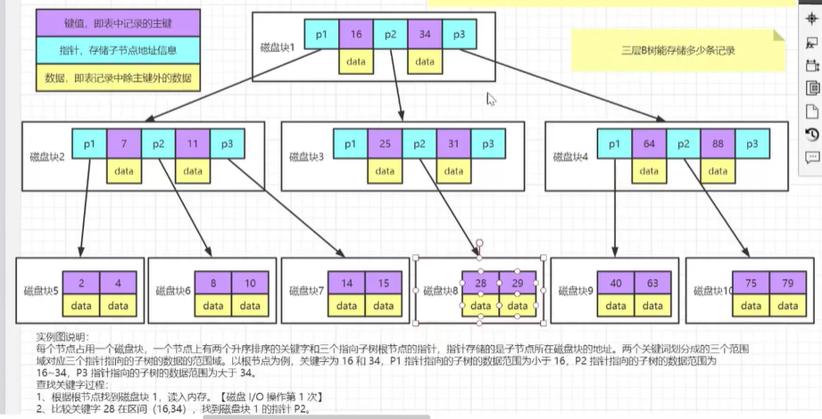

# 为什么使用索引

mysql数据存储在磁盘中

==查询慢一般是IO操作==

每次查询的时候不是要多少取多少

* 磁盘预读,内存与磁盘数据交互的时候,有一个最小逻辑单元:4k或者8k,InnoDB页面大小默认的16KB
* 

索引存储在磁盘中

==怎么提高IO效率==

* 减少次数
* 减少查询量

索引存取需要什么信息?需要存储什么值

* key:不一定是唯一标识符,没有也可以创建索引
* 文件地址:指向磁盘的一个文件
* offset:如果一个文件有多个,想取其中一个

mysql的数据结构是什么?

# 索引数据结构

> ==为什么mysql索引要用B+树?==

## 二叉树->BST->AVL->BRT

> 二叉树->二分查找数->二分平衡数->红黑树

### BST树

​ 即二叉搜索树：

​ 1.所有非叶子结点至多拥有两个儿子（Left和Right）；

​ 2.所有结点存储一个关键字；

​ 3.非叶子结点的左指针指向小于其关键字的子树，右指针指向大于其关键字的子树；

​ 如：

​

​ BST树的搜索，从根结点开始，如果查询的关键字与结点的关键字相等，那么就命中；

否则，如果查询关键字比结点关键字小，就进入左儿子；如果比结点关键字大，就进入

右儿子；如果左儿子或右儿子的指针为空，则报告找不到相应的关键字；

​ 如果BST树的所有非叶子结点的左右子树的结点数目均保持差不多（平衡），那么B树

的搜索性能逼近二分查找；但它比连续内存空间的二分查找的优点是，改变BST树结构

（插入与删除结点）不需要移动大段的内存数据，甚至通常是常数开销；

​ 如：

但BST树在经过多次插入与删除后，有可能导致不同的结构：

右边也是一个BST树，但它的搜索性能已经是线性的了；同样的关键字集合有可能导致不同的

树结构索引；所以，使用BST树还要考虑尽可能让BST树保持左图的结构，和避免右图的结构，也就

是所谓的“平衡”问题；

​

### AVL平衡二叉搜索树

定义：平衡二叉树或为空树,或为如下性质的二叉排序树:
（1）左右子树深度之差的绝对值不超过1;
（2）左右子树仍然为平衡二叉树.
平衡因子BF=左子树深度－右子树深度.
平衡二叉树每个结点的平衡因子只能是1，0，-1。若其绝对值超过1，则该二叉排序树就是不平衡的。
如图所示为平衡树和非平衡树示意图：

### RBT 红黑树

AVL是严格平衡树，因此在增加或者删除节点的时候，根据不同情况，旋转的次数比红黑树要多；
红黑是弱平衡的，用非严格的平衡来换取增删节点时候旋转次数的降低；
所以简单说，搜索的次数远远大于插入和删除，那么选择AVL树，如果搜索，插入删除次数几乎差不多，应该选择RB树。

红黑树上每个结点内含五个域，color，key，left，right，p。如果相应的指针域没有，则设为NIL。
一般的，红黑树，满足以下性质，即只有满足以下全部性质的树，我们才称之为红黑树：
1）每个结点要么是红的，要么是黑的。
2）根结点是黑的。
3）每个叶结点，即空结点（NIL）是黑的。
4）如果一个结点是红的，那么它的俩个儿子都是黑的。
5）对每个结点，从该结点到其子孙结点的所有路径上包含相同数目的黑结点。
下图所示，即是一颗红黑树：

### 总结

> 随着数据的增多,树的深度越来越深,IO的次数也会越来越多.
>
> 随着数据量的增大大,IO的次数也会会越来越多

## B树->B+数

### B树B-tree

B树和B-tree理解成了两种不同类别的树，其实这两个是同一种树;

- **概念：**

B树和平衡二叉树稍有不同的是B树属于多叉树又名平衡多路查找树（查找路径不只两个），数据库索引技术里大量使用者B树和B+树的数据结构，让我们来看看他有什么特点;

- **规则：**

（1）排序方式：所有节点关键字是按递增次序排列，并遵循左小右大原则；

（2）子节点数：非叶节点的子节点数>1，且<=M ，且M>=2，空树除外（注：M阶代表一个树节点最多有多少个查找路径，M=M路,当M=2则是2叉树,M=3则是3叉）；

（3）关键字数：枝节点的关键字数量大于等于ceil(m/2)-1个且小于等于M-1个（注：ceil()是个朝正无穷方向取整的函数 如ceil(1.1)
结果为2);

（4）所有叶子节点均在同一层、叶子节点除了包含了关键字和关键字记录的指针外也有指向其子节点的指针只不过其指针地址都为null对应下图最后一层节点的空格子;

最后我们用一个图和一个实际的例子来理解B树（这里为了理解方便我就直接用实际字母的大小来排列C>B>A）

- **B树的查询流程：**

如上图我要从上图中找到E字母，查找流程如下

（1）获取根节点的关键字进行比较，当前根节点关键字为M，E<M（26个字母顺序），所以往找到指向左边的子节点（二分法规则，左小右大，左边放小于当前节点值的子节点、右边放大于当前节点值的子节点）；

（2）拿到关键字D和G，D<E<G 所以直接找到D和G中间的节点；

（3）拿到E和F，因为E=E 所以直接返回关键字和指针信息（如果树结构里面没有包含所要查找的节点则返回null）；

- **B树的插入节点流程**

定义一个5阶树（平衡5路查找树;），现在我们要把3、8、31、11、23、29、50、28 这些数字构建出一个5阶树出来;

遵循规则：

（1）节点拆分规则：当前是要组成一个5路查找树，那么此时m=5,关键字数必须<=5-1（这里关键字数>4就要进行节点拆分）；

（2）排序规则：满足节点本身比左边节点大，比右边节点小的排序规则;

先插入 3、8、31、11

再插入23、29

再插入50、28

- **B树节点的删除**

**规则：**

（1）节点合并规则：当前是要组成一个5路查找树，那么此时m=5,关键字数必须大于等于ceil（5/2）（这里关键字数<2就要进行节点合并）；

（2）满足节点本身比左边节点大，比右边节点小的排序规则;

（3）关键字数小于二时先从子节点取，子节点没有符合条件时就向向父节点取，取中间值往父节点放；

**特点：**

B树相对于平衡二叉树的不同是，每个节点包含的关键字增多了，特别是在B树应用到数据库中的时候，数据库充分利用了磁盘块的原理（磁盘数据存储是采用块的形式存储的，每个块的大小为4K，每次IO进行数据读取时，同一个磁盘块的数据可以一次性读取出来）把节点大小限制和充分使用在磁盘快大小范围；把树的节点关键字增多后树的层级比原来的二叉树少了，减少数据查找的次数和复杂度;

------

### B+树

- **概念**

B+树是B树的一个升级版，相对于B树来说B+树更充分的利用了节点的空间，让查询速度更加稳定，其速度完全接近于二分法查找。为什么说B+树查找的效率要比B树更高、更稳定；我们先看看两者的区别

- **规则**

（1）B+跟B树不同B+树的**非叶子**节点不保存关键字记录的指针，只进行数据索引，这样使得B+树每个**非叶子**节点所能保存的关键字大大增加；

（2）B+树**叶子**节点保存了父节点的所有关键字记录的指针，所有数据地址必须要到叶子节点才能获取到。所以每次数据查询的次数都一样；

（3）B+树叶子节点的关键字从小到大有序排列，左边结尾数据都会保存右边节点开始数据的指针。

（4）非叶子节点的子节点数=关键字数（来源百度百科）（根据各种资料
这里有两种算法的实现方式，另一种为非叶节点的关键字数=子节点数-1（来源维基百科)，虽然他们数据排列结构不一样，但其原理还是一样的Mysql
的B+树是用第一种方式实现）;

**（百度百科算法结构示意图）**

**（维基百科算法结构示意图）**

### 总结

1、B+**树的层级更少**：相较于B树B+每个**非叶子**节点存储的关键字数更多，树的层级更少所以查询数据更快；

2、B+**树查询速度更稳定**：B+所有关键字数据地址都存在**叶子**节点上，所以每次查找的次数都相同所以查询速度要比B树更稳定;

3、B+**树天然具备排序功能：**B+树所有的**叶子**节点数据构成了一个有序链表，在查询大小区间的数据时候更方便，数据紧密性很高，缓存的命中率也会比B树高。

4、B+**树全节点遍历更快：**B+树遍历整棵树只需要遍历所有的**叶子**节点即可，，而不需要像B树一样需要对每一层进行遍历，这有利于数据库做全表扫描。

**B树**相对于**B+树**的优点是，如果经常访问的数据离根节点很近，而**B树**的**非叶子**节点本身存有关键字其数据的地址，所以这种数据检索的时候会要比
**B+树**快。

## 三层B树

> 假设每块磁盘大小16k

## 三层B+树

> 叶子节点才存储数据,非叶子节点不存储数据

> ==尽量保证三层的情况下,尽量支撑更多的数据量==

* ==索引引的时候尽量设置占用内存最小的字段,保证key的长度越小越好==key越小,存储的数据越大

# 存储引擎

==索引的创建跟存储引擎挂钩,存储引擎表示不同的数据在磁盘的不同组织形式==

存储引擎的概念是MySQL的特点，Oracle中没有专门的存储引擎的概念，Oracle有OLTP和OLAP模式的区分。不同的存储引擎决定了MySQL数据库中的表可以用不同的方式来存储。我们可以根据数据的特点来选择不同的存储引擎。

memory

* 使用的是hash

innodb

* 自适应hash

## 数据存储在文件

在mysql安装目录下,有一个data文件,里面存储的就是数据文件

### InnoDB引擎

.frm

* 存放的是表结构

.ibd

* 存放的是实际的数据和索引,表示==存储引擎是innodb==

### MySAM引擎

.frm

* 存放的是表结构

.MYD

* 表示data

.MYI

* 表示索引

## 聚簇索引和非聚簇索引

> ==是否是聚簇索引取决于数据是否跟索引放在一起的==

InnoDB只能有一个聚簇索引

* 数据跟索引在一起

* 向InnoDB插入的数据的时候,必须有一个包含索引的Key值
    * 这个索引的key可以是主键,唯一键,如果没有,就会自生成一个6字节的rowid
    * 如果表定义了key，则PK就是聚集索引；
    * 如果表没有定义key，则第一个not NULL unique列是聚集索引；
    * 否则，InnoDB会创建一个隐藏的row-id作为聚集索引；

Myisam

* 先到b+树中找到索引对应的地址空间,在到存放数据的文件中找到数据

### 回表

*select id,name where name='shenjian'*

*select id,name**,sex** where name='shenjian'*

**多查询了一个属性，为何检索过程完全不同？**

innodb中有聚簇索引,会先查询b+树的name找到id(聚簇索引),在查询数据列,叫回表,走2个b+树

### 索引覆盖

能够命中name索引，索引叶子节点存储了主键id，通过name的索引树即可获取id和name，无需回表，符合索引覆盖，效率较高。****

### **最左匹配原则**

**什么时候创建组合索引?**

当我们的where查询存在多个条件查询的时候，我们需要对查询的列创建组合索引

**为什么不对没一列创建索引**

- 减少开销
- 覆盖索引
- 效率高

减少开销：假如对col1、col2、col3创建组合索引，相当于创建了（col1）、（col1，col2）、（col1，col2，col3）3个索引
覆盖索引：假如查询SELECT col1, col2, col3 FROM 表名，由于查询的字段存在索引页中，那么可以从索引中直接获取，而不需要回表查询

效率高：对col1、col2、col3三列分别创建索引，MySQL只会选择辨识度高的一列作为索引。假设有100w的数据，一个索引筛选出10%的数据，那么可以筛选出10w的数据；对于组合索引而言，可以筛选出100w*
10%*10%*10%=1000条数据

假设我们创建（col1，col2，col3）这样的一个组合索引，那么相当于对col1列进行排序，也就是我们创建组合索引，以最左边的为准，只要查询条件中带有最左边的列，那么查询就会使用到索引

### 索引下推

索引条件下推优化（Index Condition Pushdown (ICP) ）是MySQL5.6添加的，用于优化数据查询。

- 不使用索引条件下推优化时存储引擎通过索引检索到数据，然后返回给MySQL服务器，服务器然后判断数据是否符合条件。
- **当使用索引条件下推优化时，如果存在某些\**被索引的列的判断条件时\**，MySQL服务器将这一部分判断条件传递给存储引擎，然后\*
  *由存储引擎通过判断索引是否符合MySQL服务器传递的条件\**，只有当索引符合条件时才会将数据检索出来返回给MySQL服务器**
  。索引条件下推优化可以减少存储引擎查询基础表的次数，也可以减少MySQL服务器从存储引擎接收数据的次数。

usertest表，

- 只是索引变了，ID字段是仍主键索引，但是我们加上一个复合索引name_age(name,age)。

  执行下面一条SQL语句：

  select * from usertest where name like 'a%' and age = 10;

  在Mysql5.6之前的执行流程是这样的：

  1.根据最左前缀原则，执行name like 'a%'可以快速检索出id的值为1，5。

  

  2.然后根据id的值进行回表操作，再次进行过滤age=10的数据。

  查询id=1回表1次，id=5回表1次，这个过程总共回表了2次。

  可能到这里都会有疑问，为什么不在索引里面直接过滤age=10的数据，因为复合索引里面也存了age的数据，这样明明可以减少回表1次。恭喜啦，Mysql5.6以后就这么做了，这就是索引下推。

