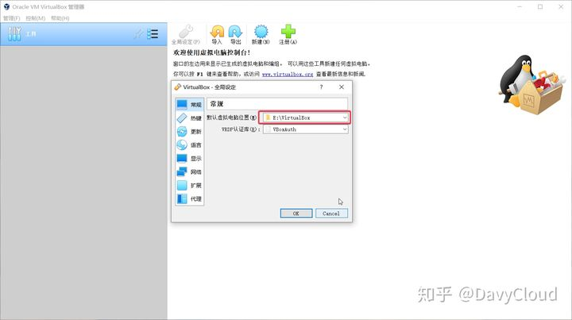
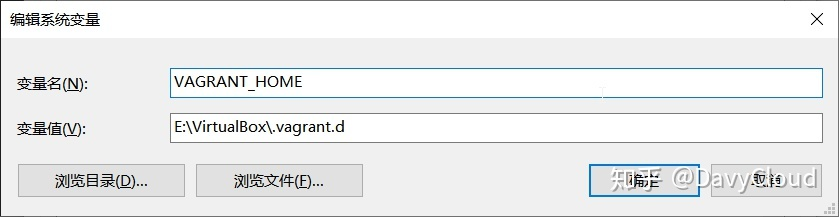

## 更新yum

```shell
# 备份原yum源
mv /etc/yum.repos.d/CentOS-Base.repo /etc/yum.repos.d/CentOS-Base.repo.backup
# 使用新yum源
curl -o /etc/yum.repos.d/CentOS-Base.repo http://mirrors.163.com/.help/CentOS7-Base-163.repo
# 生成缓存
yum makecache

```

## 配置虚机存放位置

创建虚拟机会占用较多的磁盘空间，在 Windows 系统下默认的虚机创建位置是在 C 盘，所以最好配置到其它地方。

**配置 VirtualBox**

启动 VirtualBox 后，通过菜单 `管理` -> `全局设定`，或者按下快捷键 `Ctrl + g`，在全局设定对话框中，修改 `默认虚拟电脑位置`
，指定一个容量较大的磁盘。



**配置 Vagrant**

通过 Vagrant 创建虚机需要先导入镜像文件，也就是 `box`，它们默认存储的位置在用户目录下的 `.vagrant.d` 目录下，对于 Windows
系统来说，就是 `C:\Users\用户名\.vagrant.d`。

如果后续可能会用到较多镜像，或者你的 C 盘空间比较紧缺，可以通过设置环境变量 `VAGRANT_HOME` 来设置该目录。

在 Windows 系统中，可以这样操作：新建系统环境变量，环境变量名为 `VAGRANT_HOME`，变量值为 `E:\VirtualBox\.vagrant.d`



> **注意**，最后这个 `.vagrant.d` 目录名称不是必须的，但是建议保持一致，这样一眼看上去就能知道这个目录是做什么用处的了。

## 下载虚机镜像

使用 Vagrant 创建虚机时，需要指定一个镜像，也就是 `box`。开始这个 box 不存在，所以 Vagrant 会先从网上下载，然后缓存在本地目录中。

Vagrant 有一个[镜像网站](https://link.zhihu.com/?target=https%3A//app.vagrantup.com/boxes/search)
，里面列出了都有哪些镜像可以用，并且提供了操作文档。

但是这里默认下载往往会比较慢，所以下面我会介绍如何在其它地方下载到基础镜像，然后按照自己的需要重置。如果网速较好，下载顺利的朋友可以选择性地跳过部分内容。

下面我给出最常用的两个 Linux 操作系统镜像的下载地址：

**CentOS**

CentOS
的镜像下载网站是： [http://cloud.centos.org/centos/](https://link.zhihu.com/?target=http%3A//cloud.centos.org/centos/)

在其中选择自己想要下载的版本，列表中有一个 `vagrant` 目录，里面是专门为 vagrant 构建的镜像。选择其中的 `.box`
后缀的文件下载即可。这里可以使用下载工具，以较快的速度下载下来。

这里我们选择下载的是 [CentOS 7 的最新版本](https://link.zhihu.com/?target=http%3A//cloud.centos.org/centos/7/vagrant/x86_64/images/CentOS-7.box)

**Ubuntu**

Ubuntu
的镜像下载网站是： [http://cloud-images.ubuntu.com/](https://link.zhihu.com/?target=http%3A//cloud-images.ubuntu.com/)

同样先选择想要的版本，然后选择针对 vagrant 的 `.box` 文件即可。

如果这里官网的速度较慢，还可以从 [清华大学的镜像站](https://link.zhihu.com/?target=https%3A//mirror.tuna.tsinghua.edu.cn/ubuntu-cloud-images/)
下载。

下面的例子以 CentOS 7 为例，使用其它版本操作系统的也可以参考。

## 添加 box

接下来我们需要将下载后的 `.box` 文件添加到 vagrant 中。

Vagrant 没有 GUI，只能从命令行访问，先启动一个命令行，然后执行:

```text
$ vagrant box list
There are no installed boxes! Use `vagrant box add` to add some.
```

提示现在还没有 box。如果这是第一次运行，此时 `VAGRANT_HOME` 目录下会自动生成若干的文件和文件夹，其中有一个 `boxes`
文件夹，这就是要存放 box 文件的地方。

执行 `vagrant box add` 命令添加 box:

```text
$ vagrant box add e:\Downloads\CentOS-7.box --name centos-7
==> box: Box file was not detected as metadata. Adding it directly...
==> box: Adding box 'centos-7' (v0) for provider:
    box: Unpacking necessary files from: file:///e:/Downloads/CentOS-7.box
    box:
==> box: Successfully added box 'centos-7' (v0) for 'virtualbox'!
```

命令后面跟着的是下载的文件路径，并且通过 `--name centos-7` 为这个 box 指定一个名字。

后面创建虚机都需要指定这个名字，所以尽量把名字取得简短一点，同时也要能标识出这个镜像的信息（我们后面会定制自己的基础镜像，所以这里可以简单点）。

再次查询，可以看到有了一个 box：

```text
$ vagrant box list
centos-7 (virtualbox, 0)
```

## Vagrant 基本操作

### 新建虚机

创建一个目录，先执行 `vagrant init`：

```shell
$ mkdir demo
$ cd demo
# init 虚拟机名字 --name  这个名字
$ vagrant init centos-7   


A `Vagrantfile` has been placed in this directory. You are now
ready to `vagrant up` your first virtual environment! Please read
the comments in the Vagrantfile as well as documentation on
`vagrantup.com` for more information on using Vagrant.
```

其中的 `centos-7` 就是我们要使用的 `box` 名字。

这个命令只是为我们生成一个 `Vagrantfile`，


> `虚拟机一个固定的ip地址，windows和虚拟机可以互相ping通。`

注意：如果等虚拟机启动好了，再来配置可能会出错，先配置好这个ip

更改Vagrantfile更改虚拟机ip，修改其中的config.vm.network "private_network",ip:"192.168.56.10"
，这个ip需要在windows的ipconfig中查到vitualbox的虚拟网卡ip，然后更改下最后一个数字就行（不能是1，1是我们的主机）。配置完后vagrant
reload重启虚拟机。在虚拟机中ip addr就可以查看到地址了。互相ping也能ping通。

### 启动虚机

> `vagrant up`：

```shell
$ vagrant up
Bringing machine 'default' up with 'virtualbox' provider...
==> default: Importing base box 'centos-7'...
==> default: Matching MAC address for NAT networking...
==> default: Setting the name of the VM: demo_default_1588406874156_65036
==> default: Clearing any previously set network interfaces...
==> default: Preparing network interfaces based on configuration...
    default: Adapter 1: nat
==> default: Forwarding ports...
    default: 22 (guest) => 2222 (host) (adapter 1)
==> default: Booting VM...
==> default: Waiting for machine to boot. This may take a few minutes...
    default: SSH address: 127.0.0.1:2222
    default: SSH username: vagrant
    default: SSH auth method: private key
```

vagrant ssh 连接虚拟机


> 默认只允许ssh登录方式，为了后来操作方便，文件上传等，我们可以配置允许账号密码登录

```shell
vim /etc/ssh/sshd_config
#修改
PasswordAuthentication yes
#重启
service sshd restart
#账号root
#密码vagrant
```

就可以使用第三方工具连接虚拟机

