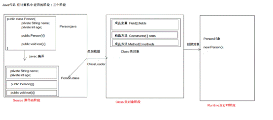
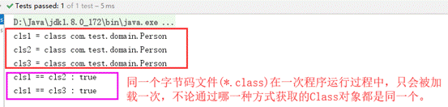
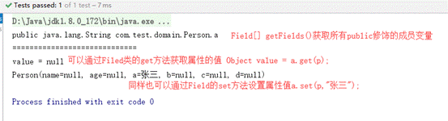
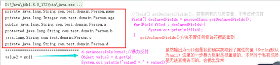
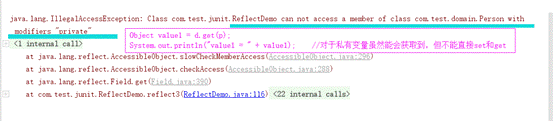
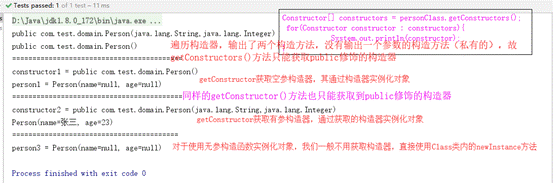
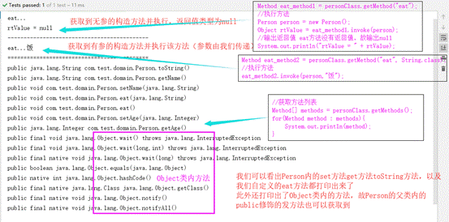
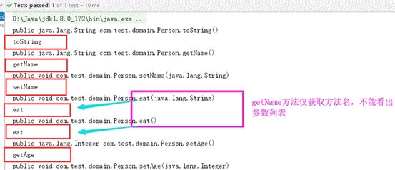
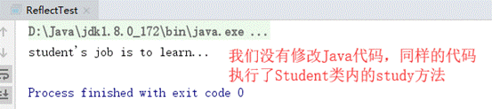

# 今日内容

	1. Junit单元测试
	2. 反射
	3. 注解

## Junit单元测试：

	* 测试分类：
		1. 黑盒测试：不需要写代码，给输入值，看程序是否能够输出期望的值。
		2. 白盒测试：需要写代码的。关注程序具体的执行流程。
	
	* Junit使用：白盒测试
		* 步骤：
			1. 定义一个测试类(测试用例)
				* 建议：
					* 测试类名：被测试的类名Test		CalculatorTest
					* 包名：xxx.xxx.xx.test		cn.itcast.test
	
			2. 定义测试方法：可以独立运行
				* 建议：
					* 方法名：test测试的方法名		testAdd()  
					* 返回值：void
					* 参数列表：空参
	
			3. 给方法加@Test
			4. 导入junit依赖环境
	
		* 判定结果：
			* 红色：失败
			* 绿色：成功
			* 一般我们会使用断言操作来处理结果
				* Assert.assertEquals(期望的结果,运算的结果);
	
		* 补充：
			* @Before:
				* 修饰的方法会在测试方法之前被自动执行
			* @After:
				* 修饰的方法会在测试方法执行之后自动被执行

## 反射：框架设计的灵魂

	* 框架：半成品软件。可以在框架的基础上进行软件开发，简化编码
	* 反射：将类的各个组成部分封装为其他对象，这就是反射机制
		* 好处：
			1. 可以在程序运行过程中，操作这些对象。
			2. 可以解耦，提高程序的可扩展性。

	* 获取Class对象的方式：
		1. Class.forName("全类名")：将字节码文件加载进内存，返回Class对象
			* 多用于配置文件，将类名定义在配置文件中。读取文件，加载类
		2. 类名.class：通过类名的属性class获取
			* 多用于参数的传递
		3. 对象.getClass()：getClass()方法在Object类中定义着。
			* 多用于对象的获取字节码的方式
	
		* 结论：
			同一个字节码文件(*.class)在一次程序运行过程中，只会被加载一次，不论通过哪一种方式获取的Class对象都是同一个。

	* Class对象功能：
		* 获取功能：
			1. 获取成员变量们
				* Field[] getFields() ：获取所有public修饰的成员变量
				* Field getField(String name)   获取指定名称的 public修饰的成员变量
	
				* Field[] getDeclaredFields()  获取所有的成员变量，不考虑修饰符
				* Field getDeclaredField(String name)  
			2. 获取构造方法们
				* Constructor<?>[] getConstructors()  
				* Constructor<T> getConstructor(类<?>... parameterTypes)  
	
				* Constructor<T> getDeclaredConstructor(类<?>... parameterTypes)  
				* Constructor<?>[] getDeclaredConstructors()  
			3. 获取成员方法们：
				* Method[] getMethods()  
				* Method getMethod(String name, 类<?>... parameterTypes)  
	
				* Method[] getDeclaredMethods()  
				* Method getDeclaredMethod(String name, 类<?>... parameterTypes)  
	
			4. 获取全类名	
				* String getName()  

	* Field：成员变量
		* 操作：
			1. 设置值
				* void set(Object obj, Object value)  
			2. 获取值
				* get(Object obj) 
	
			3. 忽略访问权限修饰符的安全检查
				* setAccessible(true):暴力反射

	* Constructor:构造方法
		* 创建对象：
			* T newInstance(Object... initargs)  
	
			* 如果使用空参数构造方法创建对象，操作可以简化：Class对象的newInstance方法

	* Method：方法对象
		* 执行方法：
			* Object invoke(Object obj, Object... args)  
	
		* 获取方法名称：
			* String getName:获取方法名

	* 案例：
		* 需求：写一个"框架"，不能改变该类的任何代码的前提下，可以帮我们创建任意类的对象，并且执行其中任意方法
			* 实现：
				1. 配置文件
				2. 反射
			* 步骤：
				1. 将需要创建的对象的全类名和需要执行的方法定义在配置文件中
				2. 在程序中加载读取配置文件
				3. 使用反射技术来加载类文件进内存
				4. 创建对象
				5. 执行方法

## 注解：

	* 概念：说明程序的。给计算机看的
	* 注释：用文字描述程序的。给程序员看的
	
	* 定义：注解（Annotation），也叫元数据。一种代码级别的说明。它是JDK1.5及以后版本引入的一个特性，与类、接口、枚举是在同一个层次。它可以声明在包、类、字段、方法、局部变量、方法参数等的前面，用来对这些元素进行说明，注释。
	* 概念描述：
		* JDK1.5之后的新特性
		* 说明程序的
		* 使用注解：@注解名称

​
​ * 作用分类：
​ ①编写文档：通过代码里标识的注解生成文档【生成文档doc文档】
​ ②代码分析：通过代码里标识的注解对代码进行分析【使用反射】
​ ③编译检查：通过代码里标识的注解让编译器能够实现基本的编译检查【Override】

	* JDK中预定义的一些注解
		* @Override	：检测被该注解标注的方法是否是继承自父类(接口)的
		* @Deprecated：该注解标注的内容，表示已过时
		* @SuppressWarnings：压制警告
			* 一般传递参数all  @SuppressWarnings("all")
	
	* 自定义注解
		* 格式：
			元注解
			public @interface 注解名称{
				属性列表;
			}
	
		* 本质：注解本质上就是一个接口，该接口默认继承Annotation接口
			* public interface MyAnno extends java.lang.annotation.Annotation {}
	
		* 属性：接口中的抽象方法
			* 要求：
				1. 属性的返回值类型有下列取值
					* 基本数据类型
					* String
					* 枚举
					* 注解
					* 以上类型的数组
	
				2. 定义了属性，在使用时需要给属性赋值
					1. 如果定义属性时，使用default关键字给属性默认初始化值，则使用注解时，可以不进行属性的赋值。
					2. 如果只有一个属性需要赋值，并且属性的名称是value，则value可以省略，直接定义值即可。
					3. 数组赋值时，值使用{}包裹。如果数组中只有一个值，则{}可以省略
		
		* 元注解：用于描述注解的注解
			* @Target：描述注解能够作用的位置
				* ElementType取值：
					* TYPE：可以作用于类上
					* METHOD：可以作用于方法上
					* FIELD：可以作用于成员变量上
			* @Retention：描述注解被保留的阶段
				* @Retention(RetentionPolicy.RUNTIME)：当前被描述的注解，会保留到class字节码文件中，并被JVM读取到
			* @Documented：描述注解是否被抽取到api文档中
			* @Inherited：描述注解是否被子类继承

	* 在程序使用(解析)注解：获取注解中定义的属性值
		1. 获取注解定义的位置的对象  （Class，Method,Field）
		2. 获取指定的注解
			* getAnnotation(Class)
			//其实就是在内存中生成了一个该注解接口的子类实现对象
	
		            public class ProImpl implements Pro{
		                public String className(){
		                    return "cn.itcast.annotation.Demo1";
		                }
		                public String methodName(){
		                    return "show";
		                }
		            }
		3. 调用注解中的抽象方法获取配置的属性值

	* 案例：简单的测试框架
	* 小结：
		1. 以后大多数时候，我们会使用注解，而不是自定义注解
		2. 注解给谁用？
			1. 编译器
			2. 给解析程序用
		3. 注解不是程序的一部分，可以理解为注解就是一个标签

反射：框架设计的灵魂

# 一、反射

## 1.1 框架

半成品软件。可以在框架的基础上进行软件开发，简化编码。学习框架并不需要了解反射，但是要是想自己写一个框架，那么就要对反射机制有很深入的了解。

## 1.2 反射

反射机制：将类的各个组成部分封装为其他对象，这就是反射机制。

反射的好处：

l 1.可以在程序运行过程中，操作这些对象。

l 2.可以解耦，提高程序的可扩展性。

Java代码在计算机中经历的三个阶段

l （1）Source源代码阶段：*.java被编译成*.class字节码文件。

l （2）Class类对象阶段：*
.class字节码文件被类加载器加载进内存，并将其封装成Class对象（用于在内存中描述字节码文件），Class对象将原字节码文件中的成员变量抽取出来封装成数组Field[]
,将原字节码文件中的构造函数抽取出来封装成数组Construction[]，在将成员方法封装成Method[]。当然Class类内不止这三个，还封装了很多，我们常用的就这三个。

l （3）RunTime运行时阶段：创建对象的过程new。

# 二、获取Class对象的方式

## 2.1 获取Class对象的三种方式对应着java代码在计算机中的三个阶段

## （1）【Source源代码阶段】 Class.forName("全类名")：将字节码文件加载进内存，返回Class对象     * 多用于配置文件，将类名定义在配置文件中。读取文件，加载类。 （2）【Class类对象阶段】 类名.class：通过类名的属性class获取     * 多用于参数的传递 （3）【Runtime运行时阶段】对象.getClass()：getClass()方法是定义在Objec类中的方法     * 多用于对象的获取字节码的方式  结论：同一个字节码文件(*.class)在一次程序运行过程中，只会被加载一次，无论通过哪一种方式获取的Class对象都是同一个。

## 2.2 测试三种获取方法

@Test public void reflect1() throws ClassNotFoundException { //方式一：Class.forName("全类名"); Class cls1 =
Class.forName("com.test.domain.Person"); //Person自定义实体类 System.out.println("cls1 = " + cls1); //方式二：类名.class
Class cls2 = Person.class; System.out.println("cls2 = " + cls2); //方式三：对象.getClass(); Person person = new Person();
Class cls3 = person.getClass(); System.out.println("cls3 = " + cls3); // == 比较三个对象 System.out.println("cls1 ==
cls2 : " + (cls1 == cls2)); //true System.out.println("cls1 == cls3 : " + (cls1 == cls3)); //true
//结论：同一个字节码文件(*.class)在一次程序运行过程中，只会被加载一次，无论通过哪一种方式获取的Class对象都是同一个。 }

# 三、 Class对象功能

## 3.1 获取功能

这里只写了一些常用的，具体可以参看jdk的帮助文档。

（1）获取成员变量们

Field[] getFields() ：获取所有public修饰的成员变量 Field getField(String name)  获取指定名称的 public修饰的成员变量
Field[] getDeclaredFields() 获取所有的成员变量，不考虑修饰符 Field getDeclaredField(String name)

（2）获取构造方法们

Constructor<?>[] getConstructors()  Constructor<T> getConstructor(类<?>... parameterTypes)
Constructor<?>[] getDeclaredConstructors()  Constructor<T> getDeclaredConstructor(类<?>... parameterTypes)

（3）获取成员方法们：

Method[] getMethods()  Method getMethod(String name,
类<?>... parameterTypes)  Method[] getDeclaredMethods()  Method getDeclaredMethod(String name, 类<?>... parameterTypes)

（4）获取全类名

String getName()

## 3.2 Field：成员变量

l （1）设置值 void set(Object obj, Object value)

l （2）获取值 get(Object obj)

l （3）忽略访问权限修饰符的安全检查 setAccessible(true):暴力反射

### 3.2.1 测试的实体类

package com.test.domain; import lombok.Getter; import lombok.Setter; import lombok.ToString; @Setter @Getter @ToString
public class Person { public String a; //最大范围public protected String b; //受保护类型 String c; //默认的访问权限
private String d; //私有类型 }

### 3.2.2 测试getFields和getField(String name)方法

/** * 1. 获取成员变量们 *   * Field[] getFields() *   * Field getField(String name) * @throws Exception */ @Test public
void reflect2() throws Exception { //0、获取Person的Class对象 Class personClass = Person.class; //1、Field[] getFields()
获取所有public修饰的成员变量 Field[] fields = personClass.getFields(); for(Field field : fields){ System.out.println(
field); } System.out.println("============================="); //2.Field getField(String name)   Field a =
personClass.getField("a"); //获取成员变量a 的值 [也只能获取公有的，获取私有的或者不存在的字符会抛出异常]   Person p = new
Person(); Object value = a.get(p); System.out.println("value = " + value); //设置属性a的值 a.set(p,"张三");
System.out.println(p); }

### 3.2.3 测试getDeclaredFields和getDeclaredField(String name)方法

/** * Field[] getDeclaredFields() * Field getDeclaredField(String name) * @throws Exception */ @Test public void
reflect3() throws Exception { Class personClass = Person.class; //Field[] getDeclaredFields()：获取所有的成员变量，不考虑修饰符
Field[] declaredFields = personClass.getDeclaredFields(); for(Field filed : declaredFields){ System.out.println(
filed); } System.out.println("==================================="); //Field getDeclaredField(String name)   Field d =
personClass.getDeclaredField("d"); //private String d; Person p = new Person(); //Object value1 = d.get(p); //会抛出异常
//System.out.println("value1 = " + value1); //对于私有变量虽然能会获取到，但不能直接set和get //忽略访问权限修饰符的安全检查
d.setAccessible(true);//暴力反射 Object value2 = d.get(p); System.out.println("value2 = " + value2); }

正常运行结果

没有忽略访问修饰符直接访问抛出的异常

## 3.3 Constructor:构造方法

创建对象：T newInstance(Object... initargs)

注意：如果使用空参数构造方法创建对象，操作可以简化：Class对象的newInstance方法

### 3.3.1 修改测试的实体类

package com.test.domain; import lombok.Getter; import lombok.Setter; import lombok.ToString; @Setter @Getter @ToString
public class Person { private String name; private Integer age; //无参构造函数 public Person() { } //单个参数的构造函数，且为私有构造方法
private Person(String name){ } //有参构造函数 public Person(String name, Integer age) { this.name = name; this.age =
age; } }

### 3.3.2 测试方法（注释很重要）

/**  * 2. 获取构造方法们 * Constructor<?>[] getConstructors() *  Constructor<T> getConstructor(类<?>...
parameterTypes) */ @Test public void reflect4() throws Exception { Class personClass = Person.class; //Constructor<?>[]
getConstructors()   Constructor[] constructors = personClass.getConstructors(); for(Constructor constructor :
constructors){ //Constructor 对象reflect包下的 import java.lang.reflect.Constructor; System.out.println(constructor); }
System.out.println("=========================================="); //获取无参构造函数 注意：Person类中必须要有无参的构造函数，不然抛出异常
Constructor constructor1 = personClass.getConstructor(); System.out.println("constructor1 = " + constructor1);
//获取到构造函数后可以用于创建对象 Object person1 = constructor1.newInstance()
;//Constructor类内提供了初始化方法newInstance();方法 System.out.println("person1 = " + person1);
System.out.println("=========================================="); //获取有参的构造函数 //public Person(String name,
Integer age) 参数类型顺序要与构造函数内一致，且参数类型为字节码类型 Constructor constructor2 =
personClass.getConstructor(String.class,Integer.class); System.out.println("constructor2 = " + constructor2); //创建对象
Object person2 = constructor2.newInstance("张三", 23); //获取的是有参的构造方法，就必须要给参数 System.out.println(
person2); System.out.println("=========================================");
//对于一般的无参构造函数，我们都不会先获取无参构造器之后在进行初始化。而是直接调用Class类内的newInstance()方法 Object
person3 = personClass.newInstance(); System.out.println("person3 = " + person3); //我们之前使用的 Class.forName("")
.newInstance; 其本质上就是调用了类内的无参构造函数来完成实例化的 //故可以得出结论 我们以后在使用 Class.forName("")
.newInstance; 反射创建对象时，一定要保证类内有无参构造函数 }

### 3.3.3 对于getDeclaredConstructor方法和getDeclaredConstructors方法

对于多出个Declared关键词的两个方法，与不带这个词的两个方法的对比。与之前3.2叙述的一样，getDeclaredConstructor方法可以获取到任何访问权限的构造器，而getConstructor方法只能获取public修饰的构造器。具体不再测试。此外在构造器的对象内也有setAccessible(
true);方法，并设置成true就可以操作了。

关于为什么要使用private访问权限的构造器，使用这个构造器不就不能外部访问了嘛，不也就无法进行实例化对象了吗？无法在类的外部实例化对象正是私有构造器的意义所在，在单例模式下经常使用，整个项目只有一个对象，外部无法实例化对象，可以在类内的进行实例化并通过静态方法返回（由于实例化的对象是静态的，故只有一个对象，也就是单例的）。网上说这就是单例模式中的饿汉模式，不管是否调用，都创建一个对象。

class SingletonDemo{ //私有化构造方法 private SingletonDemo(){ } //创建一个对象 类内实例化（静态的对象） private static
SingletonDemo singleton = new SingletonDemo(); //提供public方法供外部访问，返回这个创建的对象 public static SingletonDemo
getInstance(){ return singleton; } } public class Singleton { public static void main(String[] args) { SingletonDemo
s1 = SingletonDemo.getInstance(); //输出对象的地址，如果有地址存在，则说明对象创建成功并获取到 System.out.println(s1);
SingletonDemo s2 = SingletonDemo.getInstance(); //如果结果为true，则说明是同一个对象 System.out.println(s1==s2);
//输出结果为true } }

## 3.4 Method：方法对象

l 执行方法：Object invoke(Object obj, Object... args)

l 获取方法名称：String getName();

### 3.4.1 修改测试的实体类

package com.test.domain; import lombok.Getter; import lombok.Setter; import lombok.ToString; @Setter @Getter @ToString
public class Person { private String name; private Integer age; //无参构造函数 public Person() { } //有参构造函数 public
Person(String name, Integer age) { this.name = name; this.age = age; } //无参方法 public void eat(){
System.out.println("eat..."); } //重载有参方法 public void eat(String food){ System.out.println("eat..."+food); } }

### 3.4.2 测试invoke方法

/** * 3. 获取成员方法们： *  * Method[] getMethods() *  * Method getMethod(String name, 类<?>... parameterTypes) */ @Test
public void reflect5() throws Exception { Class personClass = Person.class; //获取指定名称的方法 Method eat_method1 =
personClass.getMethod("eat"); //执行方法 Person person = new Person(); Object rtValue = eat_method1.invoke(person)
;//如果方法有返回值类型可以获取到，没有就为null //输出返回值 eat方法没有返回值，故输出null System.out.println("
rtValue = " + rtValue); System.out.println("--------------------------------------------"); //获取有参的构造函数 有两个参数
第一个方法名 第二个参数列表 ，不同的参数是不同的方法（重载） Method eat_method2 = personClass.getMethod("eat",
String.class); //执行方法 eat_method2.invoke(person,"饭");
System.out.println("============================================"); //获取方法列表 Method[] methods =
personClass.getMethods(); for(Method method : methods){ //注意：获取到的方法名称不仅仅是我们在Person类内看到的方法
System.out.println(method); //继承下来的方法也会被获取到（当然前提是public修饰的） } }

### 3.4.3 测试getName方法

getName()方法获取的方法名是仅仅就是方法名（不带全类名），且不带有参数列表。

@Test public void reflect6() throws NoSuchMethodException { Class personClass = Person.class; Method[] methods =
personClass.getMethods(); for(Method method : methods){ System.out.println(method); //获取方法名 String name =
method.getName(); System.out.println(name); } }

### 3.4.4 关于获取成员方法们的另外两个方法

Method[] getDeclaredMethods() Method getDeclaredMethod(String name, 类<?>... parameterTypes)method.setAccessible(true);
//暴力反射

同之前的叙述一样，带有Declared关键字的方法这两个方法，可以获取到任意修饰符的方法。同样的提供了setAccessible(true);方法进行暴力反射。

**综上说述：对于反射机制来说，在反射面前没有公有私有，都可以通过暴力反射解决。**

## 3.5 获取类名

getClass()方法是Object类的方法，需要注意一点获取的类名是**全类名**（带有路径）

@Test public void reflect7(){ Class personClass = Person.class; String className = personClass.getName();
System.out.println(className); }

# 四、案例

## 4.1 案例分析

### 4.1.1 需求

写一个"框架"，**不能改变该类的任何代码的前提下**，可以帮我们创建任意类的对象，并且执行其中任意方法。

### 4.1.2 实现

（1）配置文件 （2）反射

### 4.1.3 步骤

（1）将需要创建的对象的全类名和需要执行的方法定义在配置文件中 （2）在程序中加载读取配置文件 （3）使用反射技术来加载类文件进内存
（4）创建对象 （5）执行方法

## 4.2 代码实现

### 4.2.1 需要的实体类

（1）Person类

package com.test.domain;

public class Person { //无参方法 public void eat(){ System.out.println("eat..."); } }

（2）Student类

package com.test.domain;

public class Student {

​ public void study(){

System.out.println("student's job is to learn...");

} }

### 4.2.2 编写配置文件

以后我们在配置文件内看见全类名，就应该想到可能使用到了反射

className = com.test.domain.Person methodName = eat

### 4.2.3 编写测试方法（模拟框架）

package com.test.junit; import java.io.InputStream; import java.lang.reflect.Method; import java.util.Properties; public
class ReflectTest { public static void main(String[] args) throws Exception { /**     *
前提：不能改变该类的任何代码。可以创建任意类的对象，可以执行任意方法 * 即：拒绝硬编码      */ //1.加载配置文件
//1.1创建Properties对象 Properties pro = new Properties(); //1.2加载配置文件，转换为一个集合 //1.2.1获取class目录下的配置文件
使用类加载器 ClassLoader classLoader = ReflectTest.class.getClassLoader(); InputStream is =
classLoader.getResourceAsStream("pro.properties"); pro.load(is); //2.获取配置文件中定义的数据 String className =
pro.getProperty("className"); String methodName = pro.getProperty("methodName"); //3.加载该类进内存 Class cls =
Class.forName(className); //4.创建对象 Object obj = cls.newInstance(); //5.获取方法对象 Method method = cls.getMethod(
methodName); //6.执行方法 method.invoke(obj); } }

### 4.2.4 运行结果

### 4.2.5 修改配置文件，再次运行

\#将配置文件内的信息修改为Student类及类内的方法 className = com.test.domain.Student methodName = study

## 4.3 好处

我们这样做有什么好处呢，对于框架来说，是人家封装好的，我们拿来直接用就可以了，而不能去修改框架内的代码。但如果我们使用传统的new形式来实例化，那么当类名更改时我们就要修改Java代码，这是很繁琐的。修改Java代码以后我们还要进行测试，重新编译、发布等等一系列的操作。而如果我们仅仅只是修改配置文件，就来的简单的多，配置文件就是一个实实在在的物理文件。

此外使用反射还能达到解耦的效果，假设我们使用的是new这种形式进行对象的实例化。此时如果在项目的某一个小模块中我们的一个实例类丢失了，那么在编译期间就会报错，以导致整个项目无法启动。而对于反射创建对象Class.forName("
全类名");这种形式，我们在编译期需要的仅仅只是一个字符串（全类名），在编译期不会报错，这样其他的模块就可以正常的运行，而不会因为一个模块的问题导致整个项目崩溃。这就是Spring框架中IOC控制反转的本质。