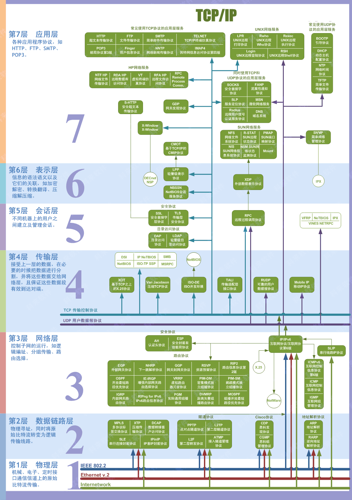

> 基本

> osi

网络七层模型，也称为OSI（Open Systems Interconnection）模型，是一个概念模型，用于描述计算机网络中不同层次之间的通信和交互。这七层分别是：

1. 物理层：负责在物理媒介（如电缆、光纤等）上传输比特流。常见的物理层技术包括以太网、DSL、ISDN等。
2. 数据链路层：负责在物理层提供的服务基础上，提供可靠的数据传输。常见的数据链路层协议包括以太网、PPP、ATM等。
3. 网络层：负责为数据包选择路由和转发。常见的网络层协议包括IP、ICMP、IGMP等。
4. 传输层：负责在网络层提供的服务基础上，提供端到端的可靠数据传输。常见的传输层协议包括TCP、UDP等。
5. 会话层：负责建立、管理和终止会话。常见的会话层协议包括SSH、TLS等。
6. 表示层：负责数据格式转换、数据加密和解密等功能。常见的表示层协议包括ASCII、JPEG、MPEG等。
7. 应用层：负责为应用程序提供网络服务。常见的应用层协议包括HTTP、FTP、SMTP、DNS等。

> tcp/ip

1. 网络接口层：负责在物理媒介（如电缆、光纤等）上传输数据帧。常见的网络接口层技术包括以太网、令牌环、FDDI等。
2. 网际层：负责为数据包选择路由和转发。常见的网际层协议包括IP、ICMP、ARP等。
3. 运输层：负责在网际层提供的服务基础上，提供端到端的可靠数据传输。常见的运输层协议包括TCP、UDP等。
4. 应用层：负责为应用程序提供网络服务。常见的应用层协议包括HTTP、FTP、SMTP、DNS等。

